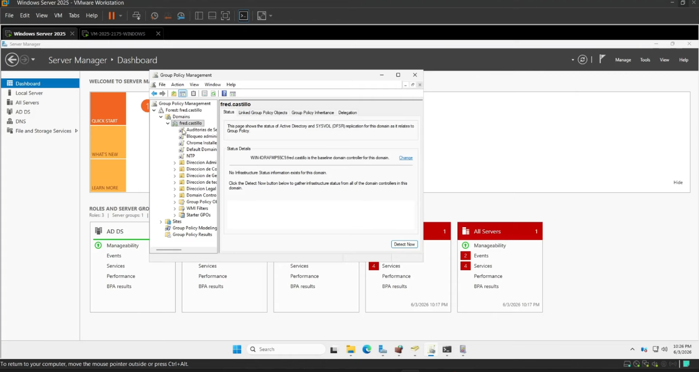
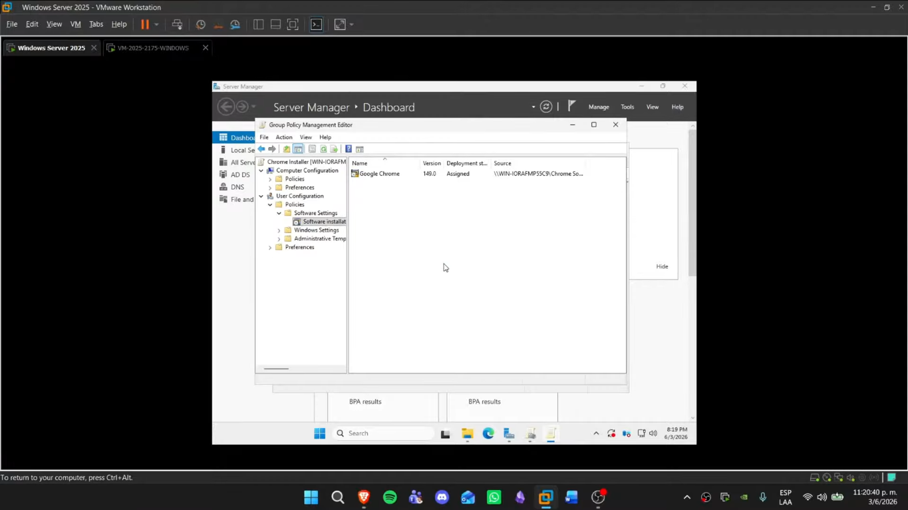
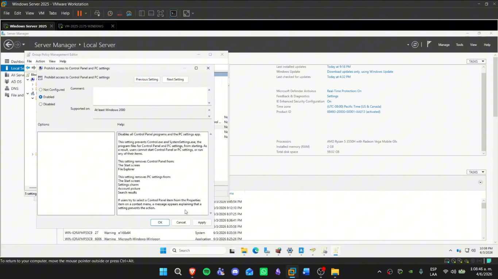
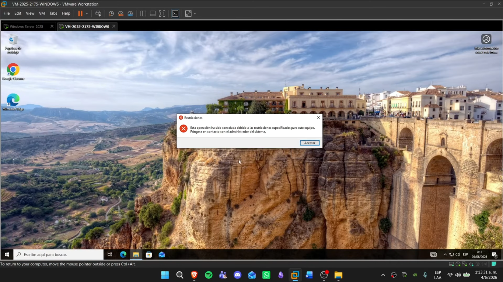
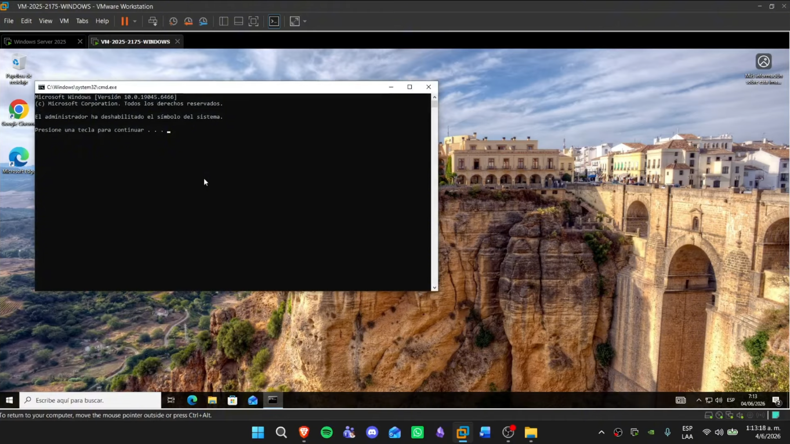
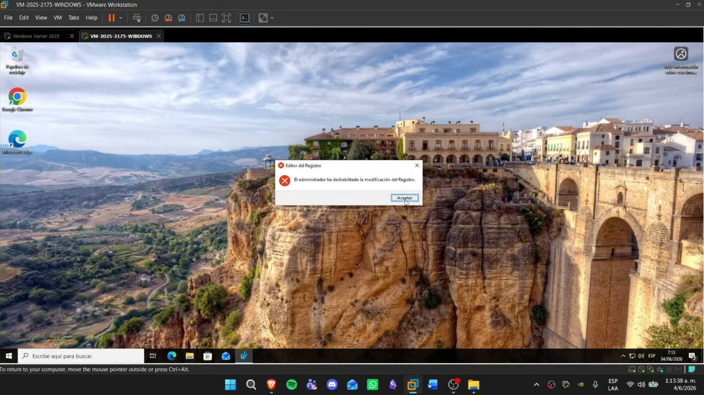
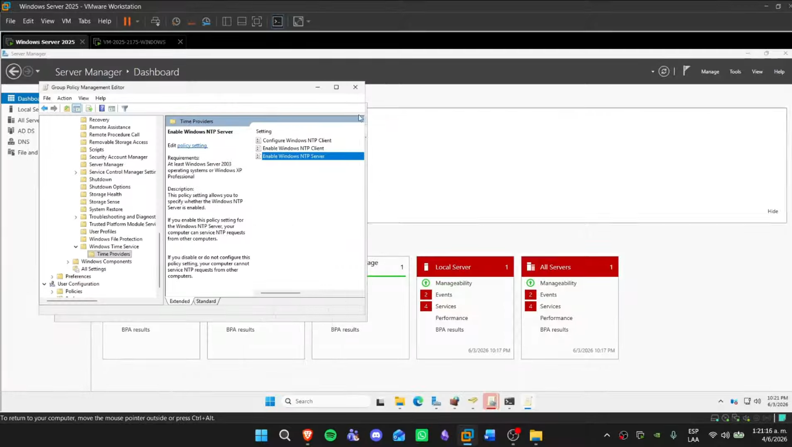
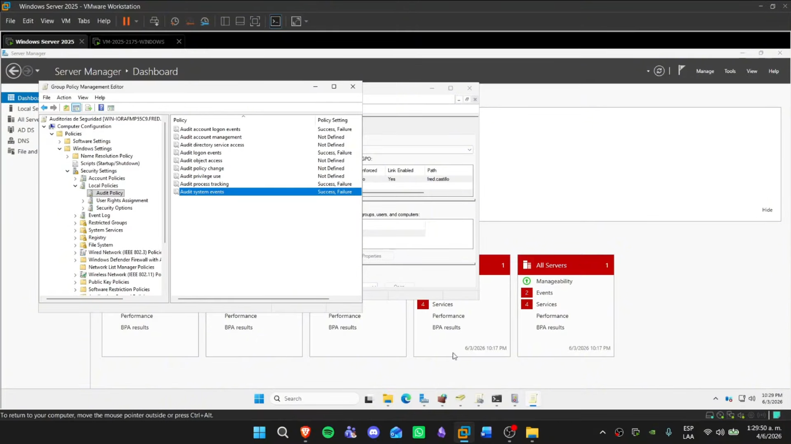
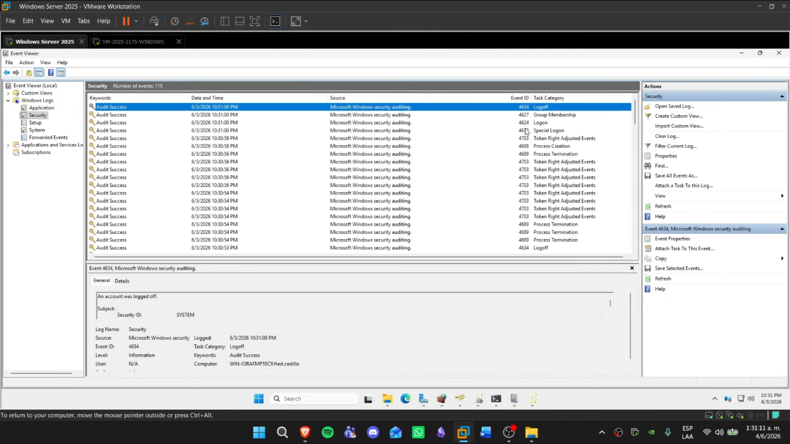
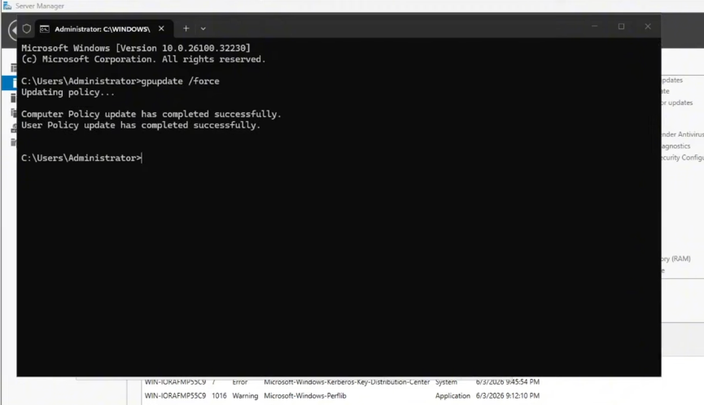

🇬🇧 **English** | 🇪🇸 [Español](README.md)

<h1 align="center">Group Policy Objects (GPO) Implementation</h1>

<p align="center">
  <a href="https://github.com/fredcastillo/ADDS-Lab"></a>
  <a href="https://github.com/fredcastillo/ADDS-Lab"></a>
  <a href="https://github.com/fredcastillo/ADDS-Lab"></a>
  <a href="https://github.com/fredcastillo/ADDS-Lab"></a>
  <a href="https://github.com/fredcastillo/ADDS-Lab"></a>
  <a href="https://github.com/fredcastillo/ADDS-Lab"></a>
  <a href="https://github.com/fredcastillo/ADDS-Lab"></a>
  <a href="https://github.com/fredcastillo/ADDS-Lab"></a>
  <a href="https://github.com/fredcastillo/ADDS-Lab/blob/main/LICENSE"></a>
  <a href="https://www.youtube.com/watch?v=hRDxHtdWJE8"></a>
</p>

## Description

Implementation and deployment of **Group Policy Objects (GPOs)** in a **Windows Server 2025** domain environment as part of the Operating Systems Security laboratory.

The practice uses Group Policy to automate software installation, restrict administrative tools, configure time synchronization, and enable security auditing policies on domain computers.

## Objective

Implement and validate the following policies:

* Automated **Google Chrome** installation through GPO.
* Restrict access to **Control Panel**.
* Restrict access to **CMD**.
* Restrict access to **Regedit**.
* Configure time synchronization through the **Domain Controller**.
* Audit logon events.
* Audit security events.
* Audit process creation and tracking.

## Environment

| Component               | Configuration                   |
| ----------------------- | ------------------------------- |
| Server operating system | Windows Server 2025             |
| Domain Controller       | `192.168.100.147`               |
| Domain                  | `fred.castillo`                 |
| Client                  | Windows 10/11                   |
| Management tool         | Group Policy Management         |
| Virtualization          | VMware Workstation              |
| Software deployed       | Google Chrome Enterprise `.msi` |

## Scenario

The laboratory builds on the domain environment configured in the previous module:

```text
fred.castillo
│
├── Active Directory
├── DNS
└── Group Policy
       │
       └── Windows Client
```

Policies are centrally managed from the Domain Controller and then validated on the client computer.

---

## Implemented Policies

| GPO                             | Purpose                            |
| ------------------------------- | ---------------------------------- |
| Chrome installer                | Automatic Google Chrome deployment |
| bloqueo administrativo cmd edit | Administrative tool restrictions   |
| NTP                             | Time synchronization               |
| auditorías de seguridad         | Security event logging             |

---

# 1. Deploy Google Chrome through GPO

The first objective is to automate Google Chrome installation on domain computers.

## 1.1 Prepare the Installer

A **Google Chrome Standalone Enterprise** `.msi` package is used.

The installer is placed in a shared folder on the server so that client computers can access the package over the network.

The deployment uses a UNC path, for example:

```text
\\DC01\Software\Chrome\GoogleChromeStandaloneEnterprise64.msi
```

> The exact path may vary depending on the laboratory configuration.

## 1.2 Create the GPO

From the Domain Controller, open:

```text
Group Policy Management
```

Create a new GPO named:

```text
Chrome installer
```

Configure the policy under:

```text
Computer Configuration
└── Policies
    └── Software Settings
        └── Software Installation
```

Add the `.msi` package using the appropriate network path.

Configure the package as:

```text
Assigned
```

This allows the installation to be managed through Group Policy.



## 1.3 Refresh the Policies

After linking the GPO to the appropriate scope, refresh Group Policy using:

```powershell
gpupdate /force
```

Restart or sign in to the client so Windows can process the software installation.

## 1.4 Validation

On the client computer, verify that **Google Chrome is installed automatically** without manually running the installer.



---

# 2. Restrict Control Panel, CMD, and Regedit

The second part of the laboratory restricts access to selected administrative tools.

A new GPO named:

```text
bloqueo administrativo cmd edit
```

is created.

## 2.1 Configure the Restrictions

The settings are configured under:

```text
User Configuration
└── Policies
    └── Administrative Templates
```

### Control Panel

Navigate to:

```text
User Configuration
└── Policies
    └── Administrative Templates
        └── Control Panel
```

Enable the appropriate policy to prevent access to Control Panel.

### CMD

Configure the Command Prompt restriction under:

```text
User Configuration
└── Policies
    └── Administrative Templates
        └── System
```

Enable the policy that prevents access to the **Command Prompt**.

### Regedit

Configure the appropriate administrative policy to prevent access to Registry editing tools.

These restrictions are managed through the same GPO.



## 2.2 Apply the Policies

On the client, refresh Group Policy:

```powershell
gpupdate /force
```

Then verify each restriction.

### Control Panel blocked



### CMD blocked



### Regedit blocked



The system should prevent access to these tools according to the configured Group Policy.

---

# 3. Configure Time Synchronization through the Domain Controller

The third configuration uses a GPO named:

```text
NTP
```

The objective is to configure domain clients to use the Domain Controller as their time reference.

The configuration is performed under:

```text
Computer Configuration
└── Policies
    └── Administrative Templates
        └── System
            └── Windows Time Service
                └── Time Providers
```

The required Windows Time Service policies are enabled for the client computers.



Time synchronization is particularly important in Active Directory environments because domain authentication mechanisms depend on appropriate time synchronization.

---

# 4. Configure Security Auditing

For the final section, a GPO named:

```text
auditorías de seguridad
```

is created.

The configuration is performed under:

```text
Computer Configuration
└── Policies
    └── Windows Settings
        └── Security Settings
            └── Local Policies
                └── Audit Policy
```

The required auditing policies are enabled to record relevant security events.

## 4.1 Logon Auditing

Configure **Logon** auditing to record both successful and failed authentication attempts.

This allows successful and unsuccessful login attempts to be identified.

## 4.2 Process Tracking

Enable auditing related to **Process Tracking** to record events associated with process creation and execution.

## 4.3 System Events

Enable policies related to **System Events** to record selected operating system events.

The audit configuration is managed through the dedicated GPO.



---

# 5. Validate through Event Viewer

To verify that auditing is working, open:

```text
Event Viewer
```

Successful and failed login attempts are generated during testing and the resulting security events are reviewed.



The presence of the expected events confirms that the audit policies are being processed.

---

# 6. Validate Applied GPOs

The applied policies can also be verified from the client using:

```powershell
gpupdate /force
```

and:

```powershell
gpresult /r
```

`gpupdate` forces a Group Policy refresh, while `gpresult` displays the policies applied to the computer and user.



---

# 7. Result

At the end of the laboratory, the domain environment contains several centrally managed policies:

```text
Domain Controller
│
├── Chrome installer
│      └── Automatic Chrome installation
│
├── bloqueo administrativo cmd edit
│      ├── Control Panel restriction
│      ├── CMD restriction
│      └── Regedit restriction
│
├── NTP
│      └── Time synchronization
│
└── auditorías de seguridad
       ├── Logon
       ├── Process Tracking
       └── System Events
```

The policies were applied and validated from the client computer, including the restriction tests and security event generation.

---

## Video

[Watch the laboratory demonstration on YouTube](https://www.youtube.com/watch?v=hRDxHtdWJE8)

---

## What I Learned

This laboratory provided hands-on experience with **Group Policy** as a centralized management mechanism for Windows computers in a domain environment.

The practice covered GPO creation and linking, software deployment, access restrictions, Windows Time Service configuration, and security event auditing.

It also demonstrated the complete Group Policy workflow:

```text
Create GPO
   ↓
Configure Policy
   ↓
Link GPO
   ↓
Refresh Policies
   ↓
Validate on Client
   ↓
Verify Results
```

---

## 👨‍💻 Author

**Fred Castillo**  
*Information Security Technology Student*

[](https://www.linkedin.com/in/fredcastillo11/)
[](https://github.com/fredcastillo)

---
