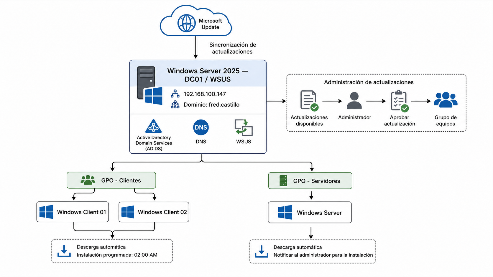

🇬🇧 **English** | 🇪🇸 [Español](README.md)

<h1 align="center">Windows Server Update Services (WSUS) Deployment</h1>

<p align="center">
  <a href="https://github.com/fredcastillo/ADDS-Lab"></a>
  <a href="https://github.com/fredcastillo/ADDS-Lab"></a>
  <a href="https://github.com/fredcastillo/ADDS-Lab"></a>
  <a href="https://github.com/fredcastillo/ADDS-Lab"></a>
  <a href="https://github.com/fredcastillo/ADDS-Lab"></a>
  <a href="https://github.com/fredcastillo/ADDS-Lab"></a>
  <a href="https://github.com/fredcastillo/ADDS-Lab"></a>
  <a href="https://github.com/fredcastillo/ADDS-Lab"></a>
  <a href="https://github.com/fredcastillo/ADDS-Lab/blob/main/LICENSE"></a>
  <a href="https://www.youtube.com/watch?v=QQKFb57v7rY"></a>
</p>

## Description

Hands-on laboratory covering the implementation of **Windows Server Update Services (WSUS)** to centrally manage and distribute updates in a Windows domain environment.

The laboratory demonstrates how to install and configure WSUS on Windows Server, select the products and update classifications to synchronize, configure domain computers through **Group Policy**, and control Windows Update behavior on clients and servers.

The laboratory also includes a test where an update is approved through WSUS and detected by a client computer.

## Objectives

* Install the WSUS role.
* Configure synchronization with Microsoft Update.
* Select Windows products to manage.
* Select update classifications.
* Create and configure a client WSUS GPO.
* Configure automatic update installation on clients.
* Schedule client update installation.
* Configure servers to download updates and notify the administrator.
* Verify applied policies using `gpresult`.
* Approve an update from WSUS.
* Verify that the client detects the update from the WSUS server.

## Environment

| Component      | Configuration                  |
| -------------- | ------------------------------ |
| Windows Server | Windows Server 2025            |
| Service        | Windows Server Update Services |
| Management     | Group Policy                   |
| Client         | Windows 10/11                  |
| Virtualization | VMware Workstation             |
| Domain         | `fred.castillo`                |

## Architecture



```text
                         Windows Server 2025
                               │
                               │ WSUS
                               ▼
                    Windows Server Update
                         Services
                               │
                ┌──────────────┴──────────────┐
                │                             │
                ▼                             ▼
          Client Computers              Server Computers
                │                             │
                │ GPO                         │ GPO
                ▼                             ▼
        Auto Download/Install          Download + Notify
        Scheduled: 2:00 AM                Administrator
                │
                ▼
         Windows Update
```

# Part 1 — WSUS Installation

## 1. Install the WSUS Role

On Windows Server, open:

```text
Server Manager
```

Select:

```text
Manage
└── Add Roles and Features
```

Use a role-based or feature-based installation.

Select:

```text
Windows Server Update Services
```

Complete the installation wizard and allow Windows Server to install the required components.

After installation, complete the WSUS post-deployment configuration and restart the server if required.


---

# Part 2 — Initial WSUS Configuration

## 2. Open the WSUS Console

After the role is installed, open:

```text
Server Manager
└── Tools
    └── Windows Server Update Services
```

The initial WSUS configuration is performed from this console.

Synchronization is configured to use:

```text
Microsoft Update
```

as the update source.


---

## 3. Select Products

During WSUS configuration, select the Microsoft products that will be managed.

This laboratory includes:

```text
Windows 10 version 1903 and later
Windows Server version 1903 and later
```

Selecting only the required products helps limit the updates synchronized by the WSUS server.


---

## 4. Select Update Classifications

WSUS allows administrators to select which types of updates should be synchronized.

This laboratory uses:

```text
Critical Updates
Security Updates
```

This focuses synchronization on critical fixes and security-related updates.


---

# Part 3 — Configure Computers through Group Policy

## 5. Configure the Client WSUS GPO

To make domain computers use the internal WSUS server instead of communicating directly with Microsoft Update, configure a Group Policy Object.

The relevant settings are located under:

```text
Computer Configuration
└── Policies
    └── Administrative Templates
        └── Windows Components
            └── Windows Update
```

Configure Windows Update to use the internal WSUS server.

A detection interval of:

```text
1 hour
```

is also configured so that clients periodically check for approved updates.


---

## 6. Schedule Client Updates

Client computers are configured to automatically download and install updates.

The configuration uses:

```text
Automatic Download and Scheduled Install
```

with a scheduled installation time of:

```text
2:00 AM
```

This allows approved updates to be downloaded and installed automatically according to the configured policy.


---

# Part 4 — Configure Servers

## 7. Configure the Server Update Policy

Servers use a different update policy from client computers.

The server configuration is:

```text
Automatic download
        +
Notify the administrator
```

before installation.

The configuration is performed through Group Policy under the Windows Update policies.


This allows different update behavior to be applied according to the system role.

---

# Part 5 — Apply and Verify the Policies

## 8. Refresh Group Policy

On the client, force a Group Policy update:

```powershell
gpupdate /force
```

Then verify the applied policies with:

```powershell
gpresult /r
```


This verifies that the WSUS-related Group Policy was received by the client.

---

# Part 6 — Approve and Test an Update

## 9. Approve an Update in WSUS

From the WSUS console, locate an available update.

The laboratory uses:

```text
Servicing Stack Update for Windows 10
```

The update is approved for:

```text
Unassigned Computers
```

After approval, WSUS can offer the update to applicable computers.


---

## 10. Verify Update Detection on the Client

On the client computer, open Windows Update.

After the client performs its detection cycle, Windows should indicate that update settings are managed by the organization.

This confirms the following workflow:

```text
WSUS
 │
 │ Approved update
 ▼
Windows Client
 │
 │ Detection
 ▼
Windows Update
 │
 ▼
Available update
```

---

# Applied Configuration

| Configuration          | Value                                   |
| ---------------------- | --------------------------------------- |
| Update source          | Microsoft Update                        |
| Products               | Windows 10 1903+ / Windows Server 1903+ |
| Classifications        | Critical Updates / Security Updates     |
| Client detection       | Every 1 hour                            |
| Client installation    | Automatic                               |
| Scheduled installation | 2:00 AM                                 |
| Server behavior        | Download and notify administrator       |
| Test                   | Update approved through WSUS            |

---

# Validation

The implementation verified:

```text
✓ WSUS installed
✓ WSUS console configured
✓ Products selected
✓ Update classifications selected
✓ Client WSUS GPO configured
✓ Client installation scheduled for 2:00 AM
✓ Server update policy configured
✓ Policies applied to the client
✓ Update approved through WSUS
✓ Client configured to use WSUS
```

---

# Result

WSUS was configured as the centralized update management point for the laboratory environment.

Client computers receive a Group Policy configuration instructing them to use the WSUS server, periodically detect updates, and automatically install approved updates at **2:00 AM**.

Servers use a separate policy that allows updates to be downloaded while notifying the administrator before installation.

Approving an update through the WSUS console allowed the complete workflow between the WSUS server and the client computer to be validated.

## Video

[Watch the laboratory demonstration on YouTube](https://www.youtube.com/watch?v=QQKFb57v7rY)

---

## 👨‍💻 Author

**Fred Castillo**  
*Information Security Technology Student*

[](https://www.linkedin.com/in/fredcastillo11/)
[](https://github.com/fredcastillo)

---
