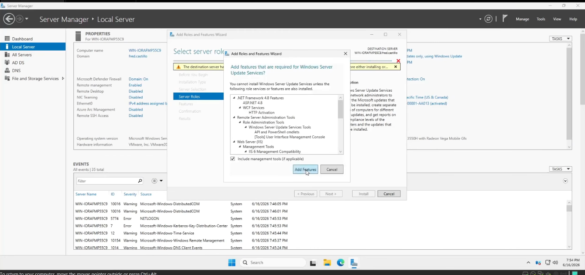
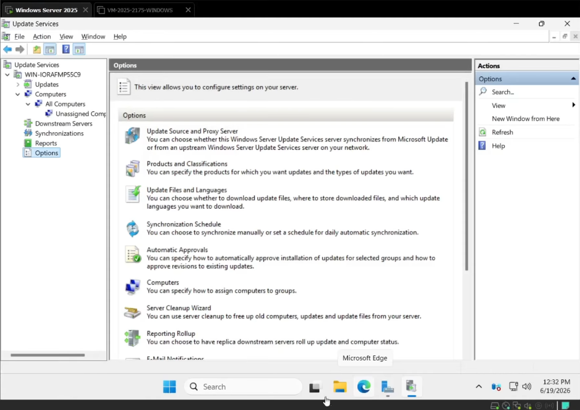
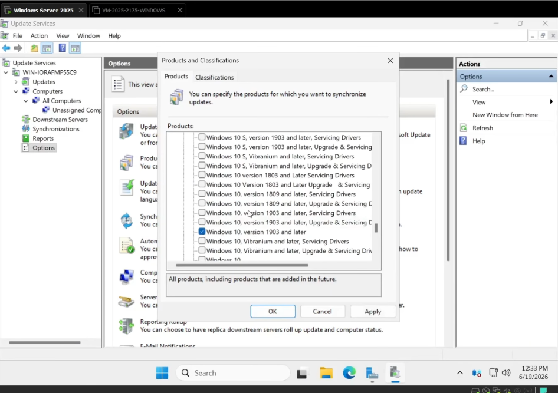
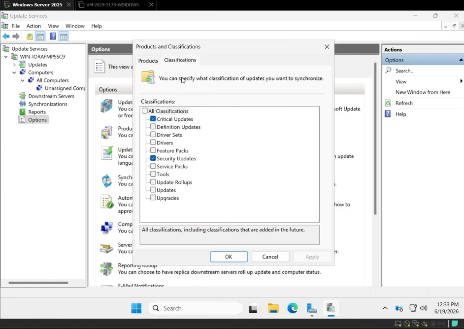
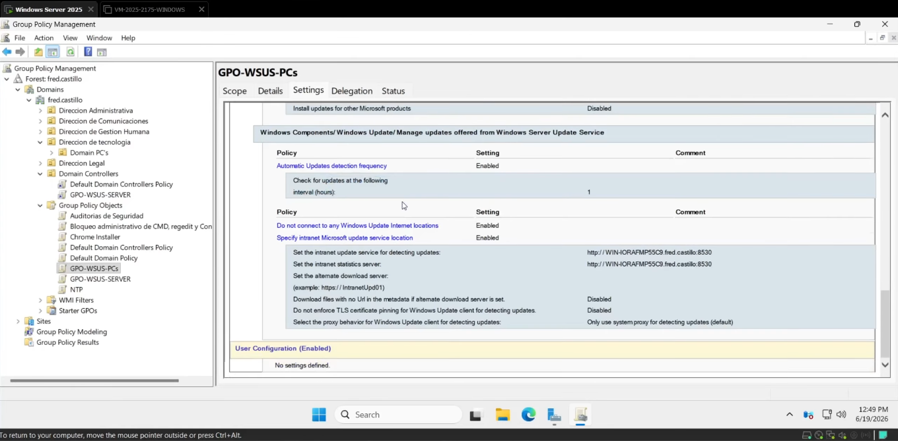
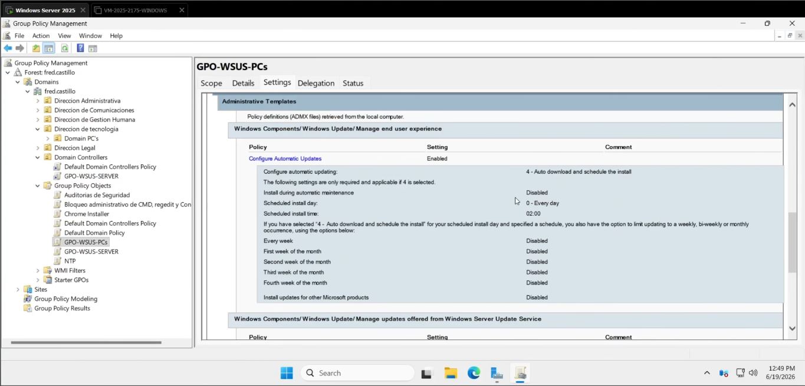
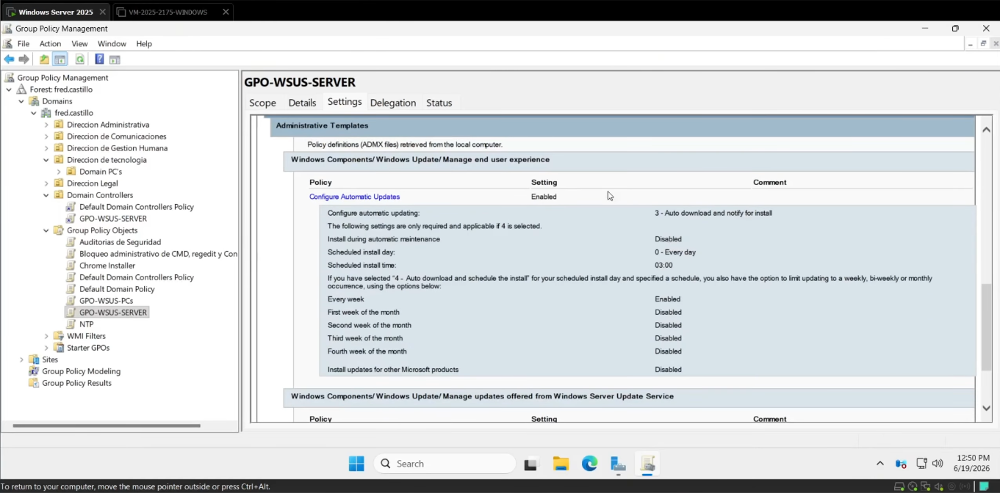
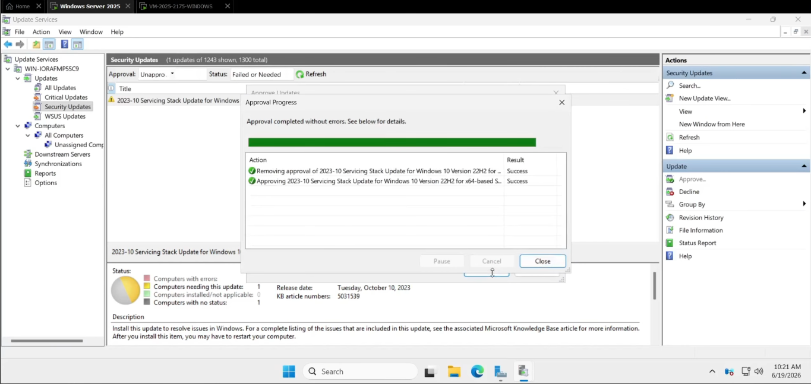

🇪🇸 **Español** | 🇬🇧 [English](README-EN.md)

<h1 align="center">Windows Server Update Services (WSUS)</h1>

<p align="center">
  <a href="https://github.com/fredcastillo/windows-server-security-lab"></a>
  <a href="https://github.com/fredcastillo/windows-server-security-lab"></a>
  <a href="https://github.com/fredcastillo/windows-server-security-lab"></a>
  <a href="https://github.com/fredcastillo/windows-server-security-lab"></a>
  <a href="https://github.com/fredcastillo/windows-server-security-lab"></a>
  <a href="https://www.youtube.com/watch?v=QQKFb57v7rY"></a>
</p>

## Descripción

Laboratorio práctico sobre la implementación de **Windows Server Update Services (WSUS)** para centralizar la administración y distribución de actualizaciones en un entorno de dominio.

La práctica demuestra cómo instalar y configurar WSUS en Windows Server, seleccionar los productos y clasificaciones que serán sincronizados, configurar los equipos mediante **Group Policy** y controlar el comportamiento de Windows Update en clientes y servidores.

También se realiza una prueba de aprobación y distribución de una actualización desde WSUS hacia un equipo cliente.

## Objetivos

* Instalar el rol de WSUS.
* Configurar la sincronización con Microsoft Update.
* Seleccionar productos de Windows para administrar.
* Seleccionar las clasificaciones de actualizaciones.
* Crear y configurar una GPO para clientes.
* Configurar la instalación automática de actualizaciones en clientes.
* Establecer una hora programada para la instalación.
* Configurar servidores para descargar actualizaciones y notificar al administrador.
* Verificar las políticas aplicadas mediante `gpresult`.
* Aprobar una actualización desde WSUS.
* Comprobar que el cliente detecta la actualización desde el servidor WSUS.

## Entorno

| Componente     | Configuración                  |
| -------------- | ------------------------------ |
| Windows Server | Windows Server 2025            |
| Servicio       | Windows Server Update Services |
| Administración | Group Policy                   |
| Cliente        | Windows 10/11                  |
| Virtualización | VMware Workstation             |
| Dominio        | `fred.castillo`                |

## Arquitectura


```text
                         Windows Server 2025
                               │
                               │ WSUS
                               ▼
                    Windows Server Update
                         Services
                               │
                ┌──────────────┴──────────────┐
                │                             │
                ▼                             ▼
          Client Computers              Server Computers
                │                             │
                │ GPO                         │ GPO
                ▼                             ▼
        Auto Download/Install          Download + Notify
        Scheduled: 2:00 AM                Administrator
                │
                ▼
         Windows Update
```

# Parte 1 — Instalación de WSUS

## 1. Instalar el rol de WSUS

En Windows Server abre:

```text
Server Manager
```

Selecciona:

```text
Manage
└── Add Roles and Features
```

Utiliza una instalación basada en roles y características.

Selecciona:

```text
Windows Server Update Services
```

Completa el asistente de instalación y deja que Windows Server configure los componentes necesarios.

Después de finalizar la instalación, completa las tareas posteriores de configuración de WSUS y reinicia el servidor si es necesario.



---

# Parte 2 — Configuración inicial de WSUS

## 2. Abrir la consola de WSUS

Una vez instalado el rol, abre:

```text
Server Manager
└── Tools
    └── Windows Server Update Services
```

Desde la consola se inicia la configuración inicial del servidor WSUS.

La sincronización se configura para utilizar:

```text
Microsoft Update
```

como origen de las actualizaciones.



---

## 3. Seleccionar los productos

Durante la configuración de WSUS se seleccionan los productos de Microsoft que serán administrados.

En este laboratorio se seleccionan productos relacionados con:

```text
Windows 10 version 1903 and later
Windows Server version 1903 and later
```

La selección de productos permite reducir el contenido descargado por WSUS y limitar la administración a los sistemas que realmente forman parte del entorno.



---

## 4. Seleccionar las clasificaciones

WSUS también permite seleccionar qué tipos de actualizaciones serán sincronizados.

En este laboratorio se utilizan:

```text
Critical Updates
Security Updates
```

De esta manera, el servidor se concentra en actualizaciones relacionadas con correcciones críticas y seguridad.



---

# Parte 3 — Configurar los equipos mediante Group Policy

## 5. Configurar la GPO para los clientes

Para que los equipos utilicen el servidor WSUS en lugar de comunicarse directamente con Microsoft Update, se configura una GPO.

La directiva se encuentra en:

```text
Computer Configuration
└── Policies
    └── Administrative Templates
        └── Windows Components
            └── Windows Update
```

Se configura el servicio de actualizaciones para utilizar el servidor WSUS interno del laboratorio.

También se establece una frecuencia de detección de actualizaciones de:

```text
1 hora
```

Esto permite que los equipos comprueben periódicamente si existen nuevas actualizaciones aprobadas en WSUS.



---

## 6. Programar las actualizaciones de los clientes

Para los equipos cliente se configura la instalación automática de las actualizaciones.

La configuración utilizada establece:

```text
Automatic Download and Scheduled Install
```

con una hora programada de:

```text
2:00 AM
```

Esto permite que las actualizaciones aprobadas sean descargadas e instaladas automáticamente de acuerdo con la política definida.



---

# Parte 4 — Configurar los servidores

## 7. Configurar la política para servidores

Los servidores utilizan una política diferente a la de los equipos cliente.

En este caso, los servidores deben:

```text
Descargar automáticamente
        +
Notificar al administrador
```

antes de realizar la instalación.

La configuración se realiza también mediante Group Policy dentro de las políticas de Windows Update.



La separación permite aplicar diferentes comportamientos según el tipo de equipo.

---

# Parte 5 — Aplicar y verificar las políticas

## 8. Actualizar las políticas

En el equipo cliente se fuerza la actualización de las directivas mediante:

```powershell
gpupdate /force
```

Después se puede comprobar qué políticas fueron aplicadas utilizando:

```powershell
gpresult /r
```


Esto permite verificar que la GPO relacionada con WSUS realmente fue recibida por el equipo.

---

# Parte 6 — Aprobar y probar una actualización

## 9. Aprobar una actualización en WSUS

Desde la consola de WSUS se localiza una actualización disponible.

En el laboratorio se utiliza:

```text
Servicing Stack Update for Windows 10
```

La actualización se aprueba para:

```text
Unassigned Computers
```

Una vez aprobada, WSUS queda preparado para ofrecer la actualización a los equipos que correspondan.



---

## 10. Verificar la detección desde el cliente

En el equipo cliente se abre Windows Update.

Después de que el equipo realice su detección, Windows debe mostrar que la configuración de actualización está siendo administrada por la organización.

La prueba confirma el flujo:

```text
WSUS
 │
 │ Actualización aprobada
 ▼
Windows Client
 │
 │ Detection
 ▼
Windows Update
 │
 ▼
Actualización disponible
```

---

# Configuración aplicada

| Configuración             | Valor                                   |
| ------------------------- | --------------------------------------- |
| Origen de actualizaciones | Microsoft Update                        |
| Productos                 | Windows 10 1903+ / Windows Server 1903+ |
| Clasificaciones           | Critical Updates / Security Updates     |
| Detección en clientes     | Cada 1 hora                             |
| Instalación en clientes   | Automática                              |
| Hora de instalación       | 2:00 AM                                 |
| Servidores                | Descargar y notificar al administrador  |
| Prueba                    | Actualización aprobada desde WSUS       |

---

# Validación

La implementación permitió comprobar:

```text
✓ WSUS instalado
✓ Consola WSUS configurada
✓ Productos seleccionados
✓ Clasificaciones seleccionadas
✓ GPO de clientes configurada
✓ Instalación programada a las 2:00 AM
✓ GPO de servidores configurada
✓ Políticas aplicadas al cliente
✓ Actualización aprobada desde WSUS
✓ Cliente configurado para utilizar WSUS
```

---

# Resultado

WSUS quedó configurado como punto central de administración de actualizaciones para los equipos del laboratorio.

Los equipos cliente reciben una política que les indica utilizar el servidor WSUS, detectar actualizaciones periódicamente y realizar las instalaciones automáticamente a las **2:00 AM**.

Los servidores utilizan una política diferente que permite descargar las actualizaciones y notificar al administrador antes de instalarlas.

La aprobación manual de una actualización desde la consola de WSUS permitió comprobar el flujo completo entre el servidor WSUS y el equipo cliente.

## Video

[Ver demostración del laboratorio en YouTube](https://www.youtube.com/watch?v=QQKFb57v7rY)

---

## 👨‍💻 Autor

**Fred Castillo**  
*Estudiante de Tecnólogo en Seguridad Informática*  
*Aspirante a Red Team | Seguridad Ofensiva*

[](https://www.linkedin.com/in/fredcastillo11/)
[](https://github.com/fredcastillo)

---
