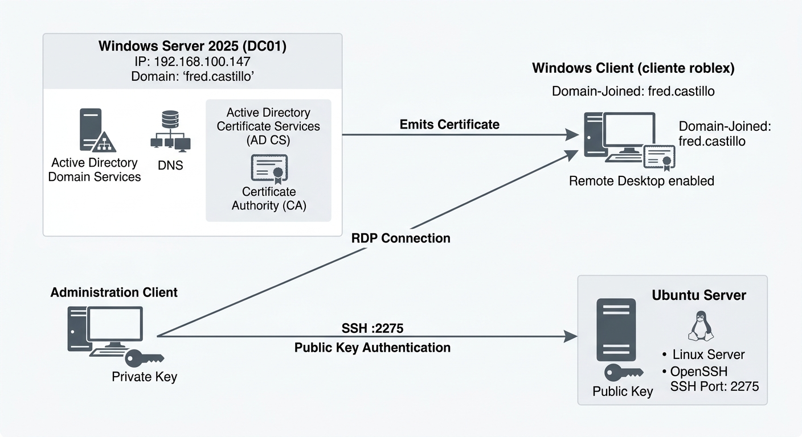

🇬🇧 **English** | 🇪🇸 [Español](README.md)

<h1 align="center">PKI and Secure Remote Access</h1>

<p align="center">
  <a href="https://github.com/fredcastillo/ADDS-Lab"></a>
  <a href="https://github.com/fredcastillo/ADDS-Lab"></a>
  <a href="https://github.com/fredcastillo/ADDS-Lab"></a>
  <a href="https://github.com/fredcastillo/ADDS-Lab"></a>
  <a href="https://github.com/fredcastillo/ADDS-Lab"></a>
  <a href="https://github.com/fredcastillo/ADDS-Lab"></a>
  <a href="https://github.com/fredcastillo/ADDS-Lab"></a>
  <a href="https://www.youtube.com/watch?v=UHC0T9EKoEw"></a>
</p>

## Description

Hands-on laboratory covering **SSH public key authentication** and the implementation of a **Public Key Infrastructure (PKI)** using Windows Server 2025.

The laboratory is divided into two parts:

1. Configuration of an Ubuntu server to use SSH public key authentication on a custom port.
2. Implementation of a Certification Authority on Windows Server 2025, creation of a certificate template, issuance of a certificate to a client computer, and association of the certificate with the RDP service.

## Objectives

* Change the SSH listening port.
* Generate an SSH key pair.
* Configure public key authentication.
* Validate an SSH connection without using the account password.
* Install Active Directory Certificate Services.
* Configure a Certification Authority.
* Create a custom certificate template.
* Allow private key export.
* Issue a certificate to a domain-joined computer.
* Export the certificate as `.pfx`.
* Associate the certificate with the RDP service.
* Validate an RDP connection using the issued certificate.

## Environment

| Component       | Configuration                         |
| --------------- | ------------------------------------- |
| Windows Server  | Windows Server 2025                   |
| Domain          | `fred.castillo`                       |
| Server IP       | `192.168.100.147`                     |
| Linux Server    | Ubuntu Server                         |
| Windows Client  | Windows 10/11                         |
| PKI             | Active Directory Certificate Services |
| CA              | Certification Authority               |
| Remote services | SSH / RDP                             |
| Virtualization  | VMware Workstation                    |
| Student ID      | `2025-2175`                           |
| SSH Port        | `2275`                                |

## Architecture
---



---

```text
                           Windows Server 2025
                           192.168.100.147
                           Domain: fred.castillo
                                  │
                    ┌─────────────┴─────────────┐
                    │                           │
                    ▼                           ▼
             Active Directory            Certificate Authority
                                                │
                                                │ Issuance
                                                ▼
                                         Windows Client
                                         cliente roblex
                                                │
                                                │ RDP
                                                │
                                                ▼
                                      Remote Desktop


Client / SSH Key
        │
        │ SSH :2275
        ▼
  Ubuntu Server
```
---

## Part 1 — SSH Public Key Authentication

### 1. Change the SSH Port

By default, SSH uses port `22`.

This laboratory uses:

```text
2275
```

The configuration is performed on the Ubuntu server.

First, open the OpenSSH configuration file:

```bash
sudo nano /etc/ssh/sshd_config
```

Locate:

```text
#Port 22
```

and change it to:

```text
Port 2275
```

Save the changes and restart the service:

```bash
sudo systemctl restart ssh
```

Verify that the service is listening on the new port:

```bash
sudo ss -tuln | grep 2275
```


The output should show port `2275` in the `LISTEN` state.

### 2. Generate the SSH Key Pair

From the computer that will connect to the server, generate a new key pair:

```bash
ssh-keygen
```

During the process, you will be prompted for:

* a location to save the key;
* an optional passphrase for protecting the private key.

The process generates:

```text
Private key
Public key
```

The private key must remain only on the client computer.


### 3. Copy the Public Key to the Server

First, identify the contents of the public key.

On Linux, for example:

```bash
cat ~/.ssh/id_rsa.pub
```

On Windows, the location depends on the key type that was generated.

The public key must be added to:

```text
~/.ssh/authorized_keys
```

on the Ubuntu server.

If the `.ssh` directory does not exist:

```bash
mkdir -p ~/.ssh
chmod 700 ~/.ssh
```

Then create or edit:

```bash
nano ~/.ssh/authorized_keys
```

Paste the public key and save the file.

Set the correct permissions:

```bash
chmod 600 ~/.ssh/authorized_keys
```

### 4. Test Authentication

From the client, connect using the custom port:

```bash
ssh -p 2275 user@SERVER_IP
```

If the configuration is correct, the server will allow authentication using the public key.


The authentication flow is:

```text
Client
   │
   │ Private key
   ▼
Ubuntu Server :2275
   │
   │ Looks for authorized public key
   ▼
~/.ssh/authorized_keys
   │
   ▼
SSH Access
```

> Never upload the private key to the repository.

---

# Part 2 — PKI Implementation

## 5. Install Active Directory Certificate Services

On Windows Server 2025, open:

```text
Server Manager
```

Select:

```text
Manage
└── Add Roles and Features
```

Use a role-based or feature-based installation.

Select:

```text
Active Directory Certificate Services
```

Under Role Services, select:

```text
Certification Authority
```

Complete the installation and configure the service.

During the configuration, the laboratory Certification Authority is established. **SHA-256** was used as the hashing algorithm in this laboratory.


Once configuration is complete, the CA is ready to issue certificates.

## 6. Create a Custom Certificate Template

Windows Server includes predefined certificate templates for different purposes.

To create a custom template:

1. Open `certtmpl.msc`.
2. Locate:

```text
Web Server
```

3. Right-click the template and select the option to duplicate it.
4. Name the new template:

```text
Certificado exportable
```


### Allow Private Key Export

Open the properties of the new template and go to:

```text
Request Handling
```

Enable:

```text
Allow private key to be exported
```

This allows the certificate to later be exported together with its private key.

### Configure Enrollment Permissions

In the Security tab, add or select:

```text
Authenticated Users
```

and grant:

```text
Enroll
```


## 7. Publish the Template on the CA

Creating a template does not automatically make it available for certificate requests.

From the Certification Authority console:

```text
Certification Authority
└── Certificate Templates
```

select the option to issue a new certificate template and add:

```text
Certificado exportable
```

The template is now available for certificate enrollment.

---

# Part 3 — Request the Certificate from the Client

## 8. Open the Certificate Store

On the domain-joined Windows client, open:

```text
certlm.msc
```

Go to:

```text
Personal
└── Certificates
```

Right-click and select the options to request a new certificate.

## 9. Select the Certificate Template

Select:

```text
Certificado exportable
```

Complete the additional information required by the certificate request.

In the demonstration, the name was configured using:

```text
Common Name
```

with:

```text
cliente roblex
```

Complete the enrollment process and verify that the certificate appears under:

```text
Personal
└── Certificates
```


---

# Part 4 — Export the Certificate

## 10. Export the Certificate and Private Key

From:

```text
certlm.msc
└── Personal
    └── Certificates
```

right-click the certificate and select:

```text
All Tasks
└── Export
```

In the wizard:

1. Select the option to **export the private key**.
2. Keep a format that supports certificates with private keys.
3. Set a password to protect the exported file.
4. Save the certificate as:

```text
.pfx
```

The `.pfx` file contains the certificate and its private key.

> **Do not upload the `.pfx` file to GitHub.** Do not publish the password used to protect it.

---

# Part 5 — Associate the Certificate with RDP

## 11. Obtain the Certificate Thumbprint

Open PowerShell as Administrator and inspect the certificate store:

```powershell
Get-ChildItem Cert:\LocalMachine\My
```

Identify the certificate issued to the client and copy its:

```text
Thumbprint
```

The thumbprint identifies the specific certificate to be used by the service.

## 12. Associate the Certificate with RDP

The certificate identified by its thumbprint is associated with the Remote Desktop service using the Windows management tools.

The intended configuration is:

```text
RDP
 │
 └── Certificate issued by the CA
```

Before applying the association, verify that the thumbprint corresponds to the correct certificate.

---

# Part 6 — Enable Remote Desktop

## 13. Enable RDP on the Client

On the client computer:

```text
Settings
└── System
    └── Remote Desktop
```

Enable **Remote Desktop**.

Make sure the account being used for the connection has permission to access the system through RDP.

---

# Part 7 — Validate the Connection

## 14. Connect Using RDP

From Windows Server 2025, open:

```text
mstsc
```

In the connection field enter:

```text
cliente roblex
```

Enter the appropriate credentials and establish the connection.

Once connected, open the connection security information.

Verify that the certificate associated with the connection corresponds to the certificate issued by the laboratory Certification Authority.

The complete flow is:

```text
Windows Server
       │
       │ Request / Trust
       ▼
Certificate Authority
       │
       │ Certificate issuance
       ▼
Windows Client
       │
       │ Certificate associated
       ▼
      RDP
       │
       ▼
Remote Connection
```

# Validation

| Component   | Validation                          |
| ----------- | ----------------------------------- |
| SSH         | Service listening on `2275`         |
| SSH         | Public key authentication           |
| AD CS       | Certification Authority installed   |
| Template    | `Certificado exportable` available  |
| Certificate | Issued to client                    |
| PFX         | Exported with private key           |
| RDP         | Certificate associated with service |
| Connection  | RDP validated from the server       |

## Video

[Watch the laboratory demonstration on YouTube](https://www.youtube.com/watch?v=UHC0T9EKoEw)

## Security

The following must not be included in this repository:

* private keys;
* `.pfx` files;
* passwords;
* credentials;
* complete SSH keys;
* any other reusable cryptographic material.

---

## 👨‍💻 Author

**Fred Castillo**  
*Information Security Technology Student*

[](https://www.linkedin.com/in/fredcastillo11/)
[](https://github.com/fredcastillo)

---

