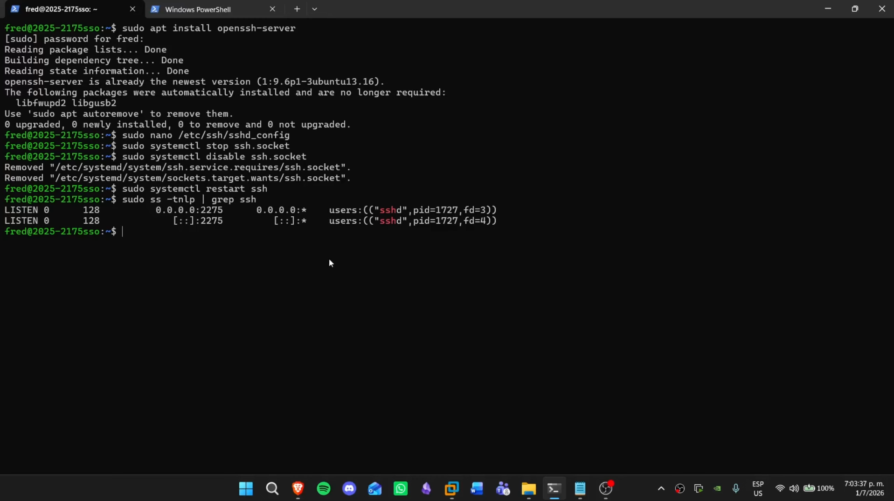
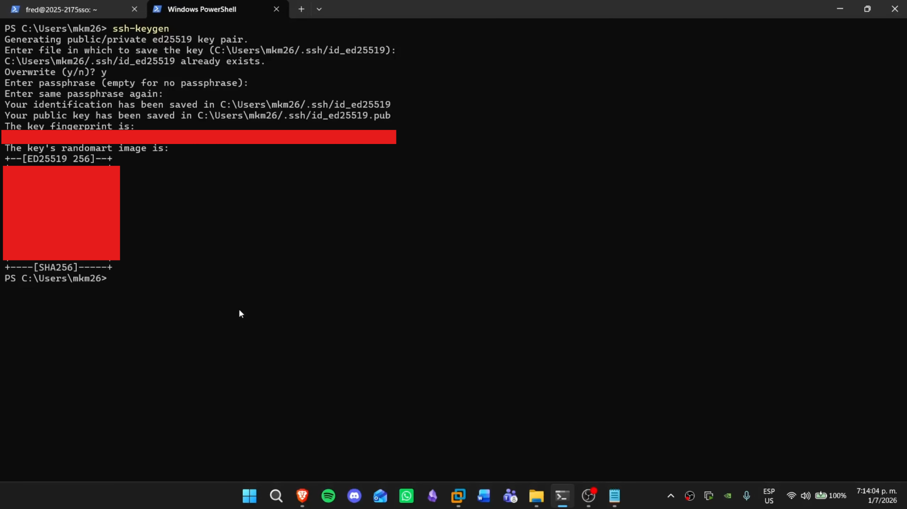
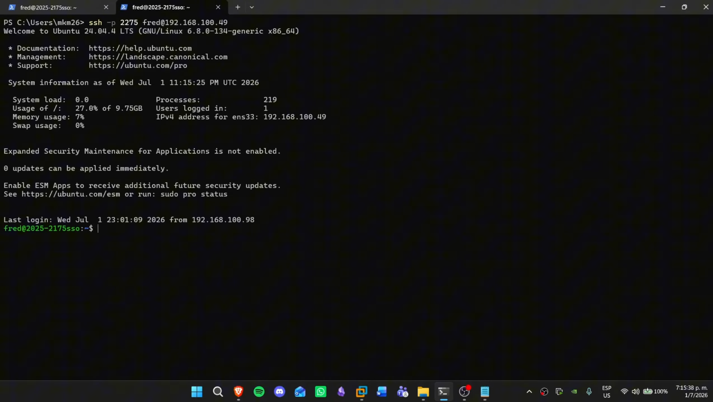
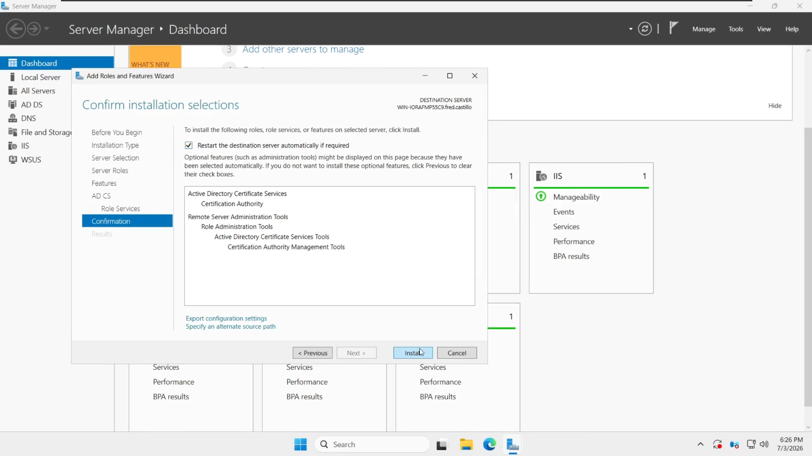
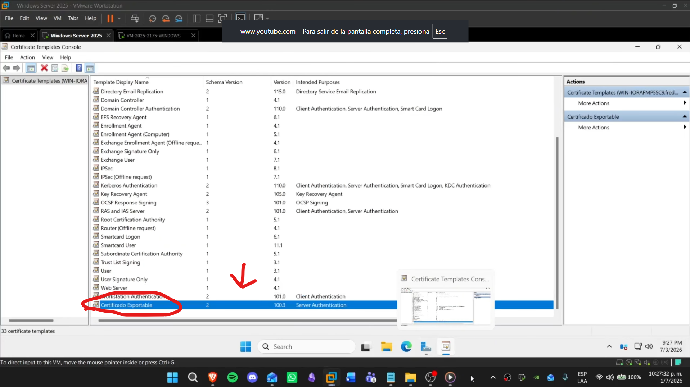
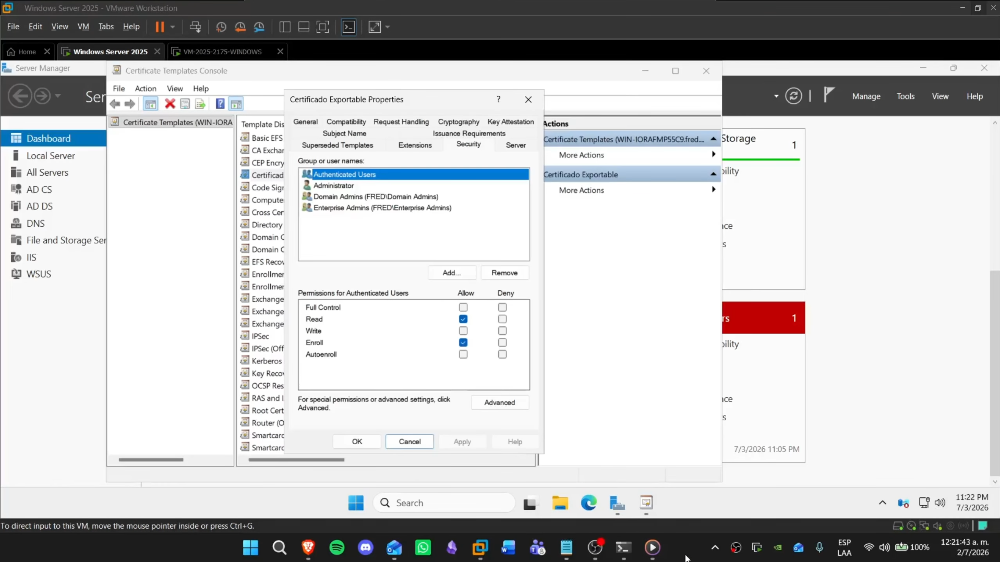
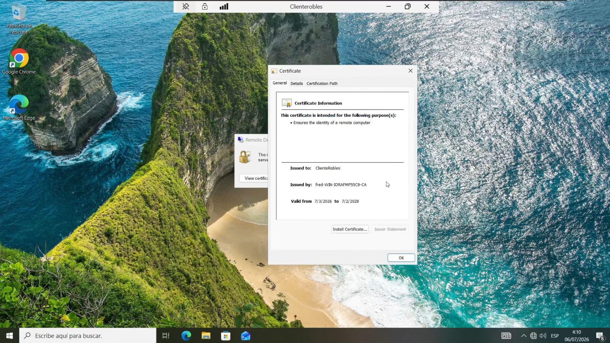

🇪🇸 **Español** | 🇬🇧 [English](README-EN.md)

<h1 align="center">PKI y Acceso Remoto Seguro</h1>

<p align="center">
  <a href="https://github.com/fredcastillo/ADDS-Lab"></a>
  <a href="https://github.com/fredcastillo/ADDS-Lab"></a>
  <a href="https://github.com/fredcastillo/ADDS-Lab"></a>
  <a href="https://github.com/fredcastillo/ADDS-Lab"></a>
  <a href="https://github.com/fredcastillo/ADDS-Lab"></a>
  <a href="https://github.com/fredcastillo/ADDS-Lab"></a>
  <a href="https://github.com/fredcastillo/ADDS-Lab"></a>
  <a href="https://www.youtube.com/watch?v=UHC0T9EKoEw"></a>
</p>

## Descripción

Laboratorio práctico sobre autenticación mediante **clave pública SSH** e implementación de una **Public Key Infrastructure (PKI)** en Windows Server 2025.

La práctica está dividida en dos partes:

1. Configuración de un servidor Ubuntu para utilizar SSH mediante autenticación por clave pública y un puerto personalizado.
2. Implementación de una Autoridad Certificadora en Windows Server 2025, creación de una plantilla de certificados, emisión de un certificado para un equipo cliente y asociación del certificado al servicio RDP.

## Objetivos

* Cambiar el puerto de escucha de SSH.
* Generar un par de claves SSH.
* Configurar autenticación mediante clave pública.
* Validar una conexión SSH sin utilizar la contraseña de la cuenta.
* Instalar Active Directory Certificate Services.
* Configurar una Autoridad Certificadora.
* Crear una plantilla de certificados personalizada.
* Permitir la exportación de la clave privada.
* Emitir un certificado a un equipo unido al dominio.
* Exportar el certificado en formato `.pfx`.
* Asociar el certificado al servicio RDP.
* Validar una conexión RDP utilizando el certificado emitido.

## Entorno

| Componente      | Configuración                         |
| --------------- | ------------------------------------- |
| Windows Server  | Windows Server 2025                   |
| Dominio         | `fred.castillo`                       |
| IP del servidor | `192.168.100.147`                     |
| Linux Server    | Ubuntu Server                         |
| Cliente Windows | Windows 10/11                         |
| PKI             | Active Directory Certificate Services |
| CA              | Certification Authority               |
| Servicio remoto | SSH / RDP                             |
| Virtualización  | VMware Workstation                    |
| Matrícula       | `2025-2175`                           |
| Puerto SSH      | `2275`                                |

## Arquitectura


```text
                           Windows Server 2025
                           192.168.100.147
                           Domain: fred.castillo
                                  │
                    ┌─────────────┴─────────────┐
                    │                           │
                    ▼                           ▼
             Active Directory            Certificate Authority
                                                │
                                                │ Emisión
                                                ▼
                                         Windows Client
                                         cliente roblex
                                                │
                                                │ RDP
                                                │
                                                ▼
                                      Remote Desktop


Client / SSH Key
        │
        │ SSH :2275
        ▼
  Ubuntu Server
```

## Parte 1 — SSH con autenticación por clave pública

### 1. Cambiar el puerto SSH

Por defecto, SSH utiliza el puerto `22`.

En este laboratorio se utiliza el puerto:

```text
2275
```

La configuración se realiza en el servidor Ubuntu.

Primero se abre el archivo de configuración de OpenSSH:

```bash
sudo nano /etc/ssh/sshd_config
```

Se busca la directiva:

```text
#Port 22
```

y se modifica para utilizar:

```text
Port 2275
```

Guarda los cambios y reinicia el servicio:

```bash
sudo systemctl restart ssh
```

Comprueba que el servicio está escuchando en el nuevo puerto:

```bash
sudo ss -tuln | grep 2275
```



El resultado debe mostrar el puerto `2275` en estado `LISTEN`.

### 2. Generar el par de claves SSH

Desde el equipo que utilizará SSH para conectarse al servidor, genera un nuevo par de claves:

```bash
ssh-keygen
```

Durante el proceso se solicitará:

* ubicación para guardar la clave;
* contraseña opcional para proteger la clave privada.

El proceso genera dos archivos:

```text
Clave privada
Clave pública
```

La clave privada debe permanecer únicamente en el equipo cliente.



### 3. Copiar la clave pública al servidor

Primero identifica el contenido de la clave pública.

En Linux, por ejemplo:

```bash
cat ~/.ssh/id_rsa.pub
```

En Windows, la ubicación depende del tipo de clave generada.

La clave pública debe agregarse al archivo:

```text
~/.ssh/authorized_keys
```

en el servidor Ubuntu.

Si el directorio `.ssh` no existe:

```bash
mkdir -p ~/.ssh
chmod 700 ~/.ssh
```

Después crea o modifica:

```bash
nano ~/.ssh/authorized_keys
```

Pega la clave pública y guarda el archivo.

Asegura los permisos:

```bash
chmod 600 ~/.ssh/authorized_keys
```

### 4. Probar la autenticación

Desde el cliente realiza una conexión indicando el puerto personalizado:

```bash
ssh -p 2275 usuario@IP_DEL_SERVIDOR
```

Si la configuración es correcta, el servidor permitirá la autenticación mediante la clave pública.



El flujo es:

```text
Cliente
   │
   │ Clave privada
   ▼
Ubuntu Server :2275
   │
   │ Busca clave pública autorizada
   ▼
~/.ssh/authorized_keys
   │
   ▼
Acceso SSH
```

> La clave privada nunca debe subirse al repositorio.

---

# Parte 2 — Implementación de PKI

## 5. Instalar Active Directory Certificate Services

En Windows Server 2025, abre:

```text
Server Manager
```

Selecciona:

```text
Manage
└── Add Roles and Features
```

Utiliza una instalación basada en roles y características.

Selecciona:

```text
Active Directory Certificate Services
```

Dentro de los servicios de rol selecciona:

```text
Certification Authority
```

Completa la instalación y ejecuta posteriormente la configuración del servicio.

Durante la configuración se establece la CA del laboratorio. En esta práctica se utilizó **SHA-256** como algoritmo de hash.



Una vez finalizada la configuración, la infraestructura queda preparada para emitir certificados.

## 6. Crear una plantilla de certificado personalizada

Windows Server incluye plantillas predefinidas para diferentes usos.

Para crear una plantilla personalizada:

1. Abre `certtmpl.msc`.
2. Localiza la plantilla:

```text
Web Server
```

3. Haz clic derecho y selecciona la opción para duplicarla.
4. Asigna el nombre:

```text
Certificado exportable
```



### Permitir exportación de la clave privada

Abre las propiedades de la nueva plantilla y entra en:

```text
Request Handling
```

Activa:

```text
Allow private key to be exported
```

Esto permitirá exportar posteriormente el certificado junto con su clave privada.

### Configurar permisos de inscripción

En la pestaña de seguridad agrega o selecciona:

```text
Authenticated Users
```

y concede:

```text
Enroll
```



## 7. Habilitar la plantilla en la CA

Crear una plantilla no significa automáticamente que la CA la vaya a ofrecer.

Desde la consola de la Autoridad Certificadora:

```text
Certification Authority
└── Certificate Templates
```

selecciona la opción para emitir una nueva plantilla y agrega:

```text
Certificado exportable
```

A partir de ese momento, la plantilla estará disponible para las solicitudes de certificados.

---

# Parte 3 — Solicitar el certificado desde el cliente

## 8. Abrir el almacén de certificados

En el equipo Windows cliente unido al dominio, abre:

```text
certlm.msc
```

Ve a:

```text
Personal
└── Certificates
```

Haz clic derecho y selecciona las opciones para solicitar un nuevo certificado.

## 9. Seleccionar la plantilla

En el asistente selecciona:

```text
Certificado exportable
```

Durante la solicitud se deberá completar la información adicional requerida.

En la demostración, el tipo utilizado para el nombre fue:

```text
Common Name
```

con el nombre:

```text
cliente roblex
```

Completa el proceso y comprueba que el certificado aparezca dentro de:

```text
Personal
└── Certificates
```



---

# Parte 4 — Exportar el certificado

## 10. Exportar el certificado y la clave privada

Desde:

```text
certlm.msc
└── Personal
    └── Certificates
```

haz clic derecho sobre el certificado y selecciona:

```text
All Tasks
└── Export
```

En el asistente:

1. Selecciona la opción para **exportar la clave privada**.
2. Mantén el formato compatible con certificados que incluyen clave privada.
3. Establece una contraseña para proteger el archivo.
4. Guarda el certificado como:

```text
.pfx
```

El archivo `.pfx` contiene el certificado y la clave privada.

> **No subas el archivo `.pfx` a GitHub.** Tampoco publiques la contraseña utilizada para protegerlo.

---

# Parte 5 — Asociar el certificado con RDP

## 11. Obtener el Thumbprint

En PowerShell como administrador, consulta el almacén de certificados:

```powershell
Get-ChildItem Cert:\LocalMachine\My
```

Identifica el certificado emitido para el cliente y copia su:

```text
Thumbprint
```

La huella digital identifica de forma concreta el certificado que será utilizado por el servicio.

## 12. Asociar el certificado al servicio RDP

El certificado identificado mediante su thumbprint se asocia al servicio de Remote Desktop utilizando las herramientas de administración disponibles en Windows.

El objetivo es que:

```text
RDP
 │
 └── Certificado emitido por la CA
```

Antes de realizar la asociación, verifica cuidadosamente que el thumbprint corresponde al certificado correcto.

---

# Parte 6 — Habilitar Remote Desktop

## 13. Activar RDP en el cliente

En el equipo cliente:

```text
Settings
└── System
    └── Remote Desktop
```

habilita **Remote Desktop**.

Asegúrate de que la cuenta utilizada para realizar la conexión tenga permisos para acceder mediante RDP.

---

# Parte 7 — Validar la conexión

## 14. Conectarse mediante RDP

Desde Windows Server 2025 abre:

```text
mstsc
```

En el campo de conexión introduce:

```text
cliente roblex
```

Introduce las credenciales correspondientes y establece la conexión.

Una vez dentro de la sesión remota, abre la información de seguridad de la conexión.

Comprueba que el certificado asociado a la conexión corresponde al certificado emitido por la Autoridad Certificadora del laboratorio.

El flujo completo es:

```text
Windows Server
       │
       │ Solicitud / confianza
       ▼
Certificate Authority
       │
       │ Emite certificado
       ▼
Windows Client
       │
       │ Certificado asociado
       ▼
      RDP
       │
       ▼
Conexión remota
```

# Validación

| Elemento    | Comprobación                        |
| ----------- | ----------------------------------- |
| SSH         | Servicio escuchando en `2275`       |
| SSH         | Acceso mediante clave pública       |
| AD CS       | Certification Authority instalada   |
| Plantilla   | `Certificado exportable` disponible |
| Certificado | Emitido al cliente                  |
| PFX         | Exportado con clave privada         |
| RDP         | Certificado asociado al servicio    |
| Conexión    | RDP validado desde el servidor      |

## Video

[Ver demostración de la práctica en YouTube](https://www.youtube.com/watch?v=UHC0T9EKoEw)

## Seguridad

No se deben incluir en este repositorio:

* claves privadas;
* archivos `.pfx`;
* contraseñas;
* credenciales;
* claves SSH completas;
* cualquier otro material criptográfico reutilizable.

---

## 👨‍💻 Autor

**Fred Castillo**  
*Estudiante de Tecnólogo en Seguridad Informática*  

[](https://www.linkedin.com/in/fredcastillo11/)
[](https://github.com/fredcastillo)

---
