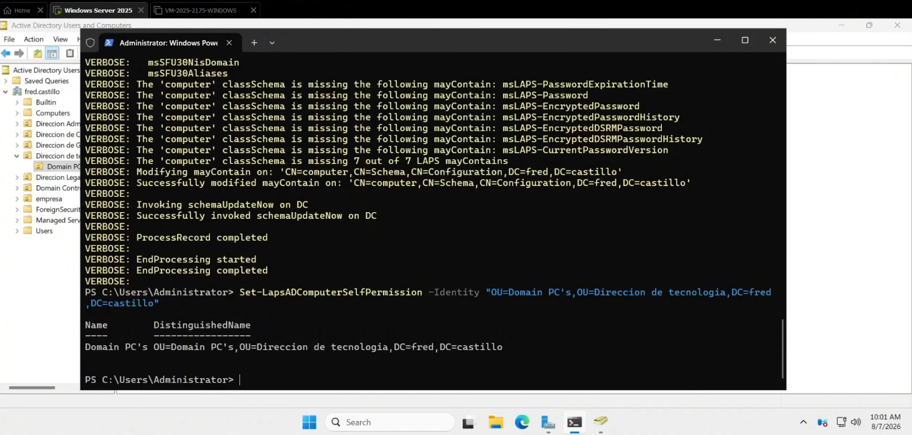

🇬🇧 **English** | 🇪🇸 [Español](README.md)

<h1 align="center">Microsoft LAPS — Local Administrator Password Solution</h1>

<p align="center">
  <a href="https://github.com/fredcastillo/ADDS-Lab"></a>
  <a href="https://github.com/fredcastillo/ADDS-Lab"></a>
  <a href="https://github.com/fredcastillo/ADDS-Lab"></a>
  <a href="https://github.com/fredcastillo/ADDS-Lab"></a>
  <a href="https://github.com/fredcastillo/ADDS-Lab"></a>
  <a href="https://github.com/fredcastillo/ADDS-Lab"></a>
  <a href="https://github.com/fredcastillo/ADDS-Lab"></a>
  <a href="https://www.youtube.com/watch?v=YlgSQf2m3us"></a>
</p>

## Objective

Implement and demonstrate **Microsoft Local Administrator Password Solution (LAPS)** in a domain environment using Windows Server 2025 and a domain-joined client computer.

The laboratory demonstrates how LAPS automatically manages the local administrator password, stores the information in Active Directory, and controls which users are allowed to retrieve it.

The configuration used in the laboratory is:

* **Minimum password length:** 16 characters
* **Password expiration:** 50 days
* **Backup directory:** Active Directory
* **Authorized password readers:** `IT Support`

---

## What is Microsoft LAPS?

Microsoft LAPS (Local Administrator Password Solution) is a tool used to manage local administrator account passwords on domain-joined computers.

Instead of using the same administrator password across multiple machines, LAPS allows credentials to be managed individually. The password is automatically generated, applied to the local administrator account, and stored in Active Directory.

Access to this information can be restricted through delegated permissions.

This helps reduce the risks associated with credential reuse and limits opportunities for lateral movement between systems.

---

## Lab Environment

| Component               | Configuration                    |
| ----------------------- | -------------------------------- |
| Server                  | Windows Server 2025              |
| Directory service       | Active Directory Domain Services |
| Tool                    | Microsoft LAPS                   |
| Client                  | Windows 10/11                    |
| Managed OU              | `Domain PC`                      |
| Client computer         | `cliente roblex`                 |
| Authorized group        | `IT Support`                     |
| Minimum password length | 16 characters                    |
| Password expiration     | 50 days                          |
| Backup location         | Active Directory                 |

---

## How It Works

The workflow implemented in the laboratory is:

```text
                    Active Directory
                          │
             ┌────────────┴────────────┐
             │                         │
        Domain PC                 IT Support
             │                  can retrieve
             │                  LAPS passwords
             ▼
       Client Computer
             │
             ▼
        Microsoft LAPS
             │
             ▼
   Administrator Account
             │
             ▼
     Generated Password
             │
             ▼
      AD Password Backup
```

---

# 1. Verify the Active Directory Structure

Before configuring LAPS, the existing Active Directory structure is verified using **Active Directory Users and Computers**.

The OU containing the client computer must be identified because it will later be used for permission delegation and GPO linking.

In this laboratory:

```text
Domain PC
└── cliente roblex
```

---

# 2. Update the Active Directory Schema

LAPS requires specific Active Directory attributes to store information related to managed passwords.

On the server, open **PowerShell as Administrator** and run:

```powershell
Update-LapsADSchema
```

After confirming the operation, delegate permission for the computers to update their own LAPS information within the OU:

```powershell
Set-LapsADComputerSelfPermission -Identity "Domain PC"
```

Then configure the group that will be allowed to retrieve the passwords:

```powershell
Set-LapsADReadPasswordPermission `
    -Identity "Domain PC" `
    -AllowedPrincipals "IT Support"
```



This establishes two different permission scopes:

```text
Computer
 └── Can update its own LAPS information

IT Support
 └── Can retrieve LAPS passwords
```

---

# 3. Create the IT Support Group

In **Active Directory Users and Computers**, create a security group named:

```text
IT Support
```

This group is used to control which users can retrieve passwords managed by LAPS.


Once the group exists, it is used in the password read permission configuration applied to the target OU.

---

# 4. Create the LAPS GPO

Open **Group Policy Management** and create a new Group Policy Object named:

```text
LAPS
```

The LAPS settings are located under:

```text
Computer Configuration
└── Policies
    └── Administrative Templates
        └── System
            └── LAPS
```

---

# 5. Configure Password Settings

Inside the GPO, enable:

```text
Password Settings
```

The following values are configured:

| Parameter               |         Value |
| ----------------------- | ------------: |
| Minimum password length | 16 characters |
| Password age            |       50 days |

This configures a minimum password length of 16 characters and a 50-day password expiration period.

The following policy is also enabled:

```text
Configure password backup directory
```

with:

```text
Active Directory
```

as the backup directory.


---

# 6. Link the GPO to the OU

The:

```text
LAPS
```

GPO is linked to:

```text
Domain PC
```

where the client computer is located.

The resulting structure is:

```text
Domain
└── Domain PC
      └── LAPS
```


The client computer can now receive the LAPS configuration through Group Policy.

---

# 7. Apply the Policies on the Client

On the client computer, open **PowerShell as Administrator** and run:

```powershell
gpupdate /force
```

This forces the computer to refresh its Group Policy configuration from the domain.

The applied policies can be checked using:

```powershell
gpresult /r
```

---

# 8. Force LAPS Policy Processing

After the GPO has been applied, force LAPS policy processing:

```powershell
Invoke-LapsPolicyProcessing
```

This causes the client to process the LAPS configuration and update the local administrator password.

The workflow is:

```text
GPO
 ↓
LAPS Policy
 ↓
Password generation
 ↓
Administrator password update
 ↓
Active Directory backup
```

---

# 9. Retrieve the Managed Password

From the server, open:

```text
Active Directory Users and Computers
```

Locate:

```text
Domain PC
└── cliente roblex
```

Open the computer properties:

```text
Properties
└── LAPS
```

This section contains the information managed by LAPS, including the generated password for the local administrator account and its expiration information.


The actual password shown in the screenshot should be hidden before publishing the image to GitHub.

---

# 10. Validate Local Administrator Access

Finally, verify that the LAPS-generated password was successfully applied to the local administrator account.

On the client, select:

```text
.\Administrator
```

and enter the password generated by LAPS.


A successful login confirms the complete workflow:

```text
Active Directory
      ↓
LAPS GPO
      ↓
Client Computer
      ↓
Password Generation
      ↓
Administrator Password Update
      ↓
Active Directory Backup
      ↓
Authorized Retrieval
      ↓
Successful Login
```

---

# Final Configuration

| Parameter               | Configuration    |
| ----------------------- | ---------------- |
| Tool                    | Microsoft LAPS   |
| Minimum password length | 16 characters    |
| Password expiration     | 50 days          |
| Backup directory        | Active Directory |
| Managed OU              | `Domain PC`      |
| Client computer         | `cliente roblex` |
| Authorized group        | `IT Support`     |
| Managed account         | `Administrator`  |

---

# Result

The implementation demonstrated centralized management of the local administrator password using Microsoft LAPS.

The configuration uses a minimum password length of **16 characters**, a **50-day expiration period**, and **Active Directory** as the backup directory. Password retrieval was delegated to the **IT Support** security group.

The final validation confirmed the implementation by successfully logging in to the local administrator account using the password generated by LAPS.

## Video

Complete laboratory demonstration:

[Microsoft LAPS — Demonstration](VIDEO_LINK)

---

## 👨‍💻 Autor

**Fred Castillo**  
*Information Security Technology Student*

[](https://www.linkedin.com/in/fredcastillo11/)
[](https://github.com/fredcastillo)

---
