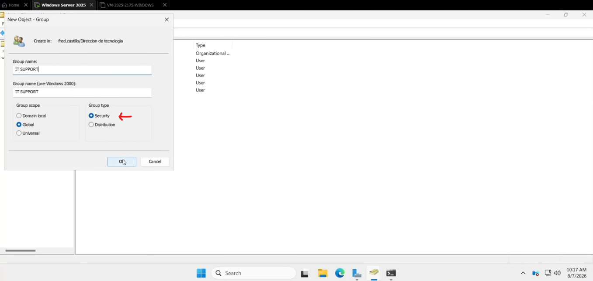
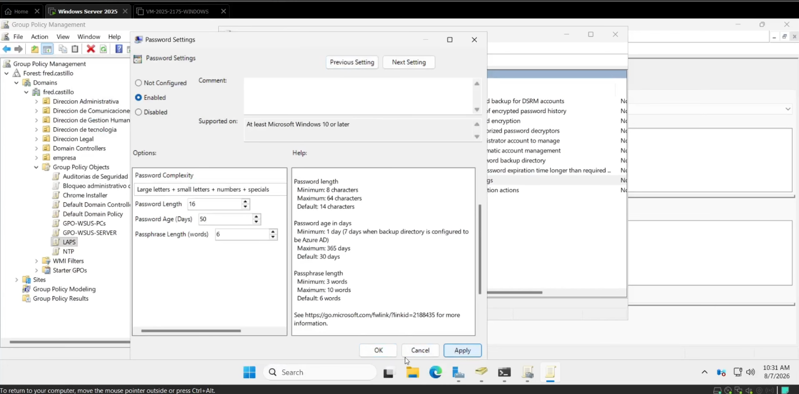
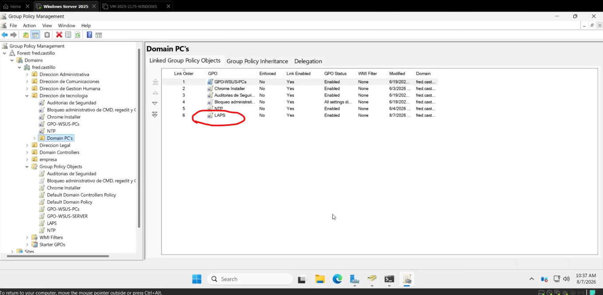
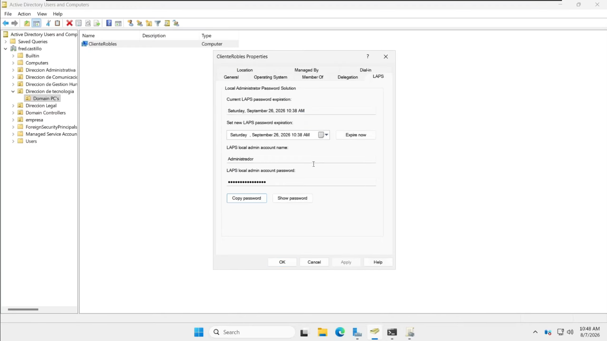
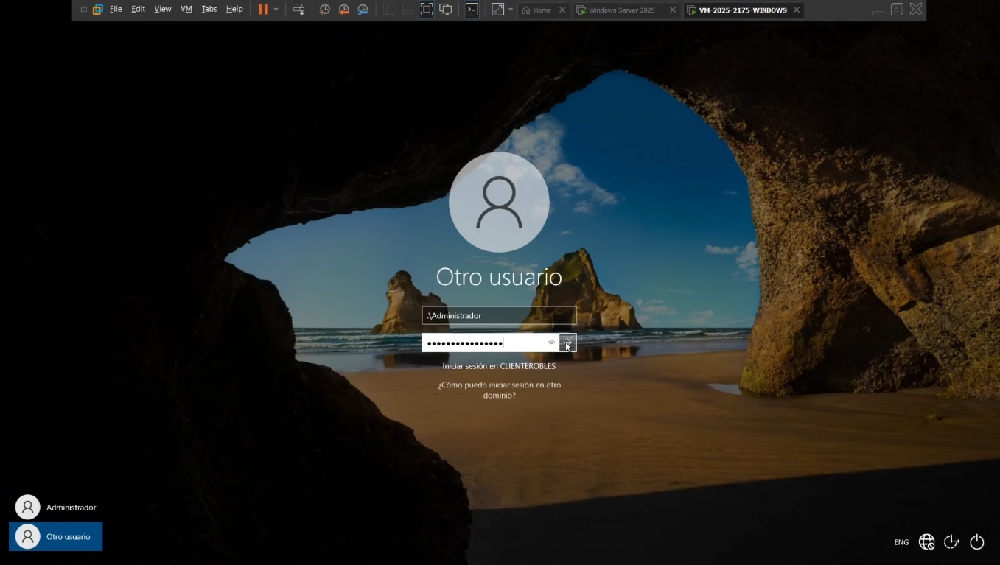

🇪🇸 **Español** | 🇬🇧 [English](README-EN.md)

<h1 align="center">Microsoft LAPS — Local Administrator Password Solution</h1>

<p align="center">
  <a href="https://github.com/fredcastillo/ADDS-Lab"></a>
  <a href="https://github.com/fredcastillo/ADDS-Lab"></a>
  <a href="https://github.com/fredcastillo/ADDS-Lab"></a>
  <a href="https://github.com/fredcastillo/ADDS-Lab"></a>
  <a href="https://github.com/fredcastillo/ADDS-Lab"></a>
  <a href="https://github.com/fredcastillo/ADDS-Lab"></a>
  <a href="https://github.com/fredcastillo/ADDS-Lab"></a>
  <a href="https://www.youtube.com/watch?v=YlgSQf2m3us"></a>
</p>

## Objetivo

Implementar y demostrar el funcionamiento de **Microsoft Local Administrator Password Solution (LAPS)** en un entorno de dominio utilizando Windows Server 2025 y un equipo cliente unido al dominio.

El laboratorio muestra cómo LAPS permite administrar automáticamente la contraseña de la cuenta de administrador local, almacenarla en Active Directory y controlar qué usuarios pueden consultarla.

La configuración realizada establece:

* **Longitud mínima de contraseña:** 16 caracteres
* **Tiempo de expiración:** 50 días
* **Directorio de respaldo:** Active Directory
* **Grupo autorizado para consultar la contraseña:** `IT Support`

---

## ¿Qué es Microsoft LAPS?

Microsoft LAPS (Local Administrator Password Solution) es una herramienta utilizada para administrar las contraseñas de las cuentas de administrador local de equipos unidos a un dominio.

En lugar de utilizar una misma contraseña en múltiples equipos, LAPS permite administrar credenciales de manera individual. La contraseña es generada automáticamente, aplicada a la cuenta de administrador local y almacenada en Active Directory.

El acceso a esta información puede restringirse mediante permisos delegados.

Esto ayuda a reducir el riesgo asociado con la reutilización de credenciales administrativas y limita las posibilidades de movimiento lateral entre equipos.

---

## Entorno del laboratorio

| Componente             | Configuración                    |
| ---------------------- | -------------------------------- |
| Servidor               | Windows Server 2025              |
| Servicio de directorio | Active Directory Domain Services |
| Herramienta            | Microsoft LAPS                   |
| Cliente                | Windows 10/11                    |
| OU administrada        | `Domain PC`                      |
| Equipo cliente         | `cliente roblex`                 |
| Grupo autorizado       | `IT Support`                     |
| Longitud mínima        | 16 caracteres                    |
| Expiración             | 50 días                          |
| Respaldo               | Active Directory                 |

---

## Funcionamiento

El flujo implementado en el laboratorio es:

```text
                    Active Directory
                          │
             ┌────────────┴────────────┐
             │                         │
        Domain PC                 IT Support
             │                  puede consultar
             │                  contraseñas LAPS
             ▼
       Equipo cliente
             │
             ▼
      Microsoft LAPS
             │
             ▼
   Cuenta Administrator
             │
             ▼
    Contraseña generada
             │
             ▼
     Respaldo en AD
```

---

# 1. Verificar la estructura de Active Directory

Antes de configurar LAPS se verifica la estructura existente en **Active Directory Users and Computers**.

La OU donde se encuentra el equipo cliente debe estar identificada, ya que será utilizada posteriormente para configurar los permisos y vincular la GPO.

En este laboratorio:

```text
Domain PC
└── cliente roblex
```

---

# 2. Actualizar el esquema de Active Directory

LAPS necesita atributos específicos dentro de Active Directory para almacenar la información relacionada con las contraseñas administradas.

Desde el servidor se abre **PowerShell como administrador** y se ejecuta:

```powershell
Update-LapsADSchema
```

Después de confirmar la operación, se delega a los equipos la capacidad de actualizar su propia información de LAPS dentro de la OU:

```powershell
Set-LapsADComputerSelfPermission -Identity "Domain PC"
```

Posteriormente se configura el grupo que tendrá permiso para consultar las contraseñas:

```powershell
Set-LapsADReadPasswordPermission `
    -Identity "Domain PC" `
    -AllowedPrincipals "IT Support"
```


Con esto se establecen dos permisos diferentes:

```text
Equipo
 └── Puede actualizar su propia información LAPS

IT Support
 └── Puede consultar las contraseñas LAPS
```

---

# 3. Crear el grupo IT Support

En **Active Directory Users and Computers** se crea un grupo de seguridad llamado:

```text
IT Support
```

Este grupo se utilizará para controlar quién puede consultar las contraseñas almacenadas por LAPS.



Una vez creado el grupo, su identidad se utiliza para realizar la delegación de permisos de lectura sobre la OU administrada.

---

# 4. Crear la GPO de LAPS

Desde **Group Policy Management** se crea una nueva GPO llamada:

```text
LAPS
```

La configuración de LAPS se encuentra en:

```text
Computer Configuration
└── Policies
    └── Administrative Templates
        └── System
            └── LAPS
```

---

# 5. Configurar Password Settings

Dentro de la GPO se habilita la política:

```text
Password Settings
```

Se establecen los siguientes valores:

| Parámetro               |         Valor |
| ----------------------- | ------------: |
| Minimum password length | 16 caracteres |
| Password age            |       50 días |

La contraseña administrada por LAPS tendrá una longitud mínima de 16 caracteres y se renovará de acuerdo con el período configurado.

También se habilita:

```text
Configure password backup directory
```

y se establece:

```text
Active Directory
```

como directorio de respaldo.



---

# 6. Vincular la GPO a la OU

La GPO:

```text
LAPS
```

se vincula a:

```text
Domain PC
```

donde se encuentra el equipo cliente.

La estructura queda:

```text
Domain
└── Domain PC
      └── LAPS
```



De esta manera, el equipo cliente recibe la configuración de LAPS mediante Group Policy.

---

# 7. Aplicar las políticas en el cliente

En el equipo cliente se abre **PowerShell como administrador** y se ejecuta:

```powershell
gpupdate /force
```

Esto fuerza la actualización de las políticas de grupo recibidas desde el dominio.

Para comprobar las políticas aplicadas se puede utilizar:

```powershell
gpresult /r
```

---

# 8. Forzar el procesamiento de LAPS

Después de aplicar la GPO, se fuerza el procesamiento de la política de LAPS mediante:

```powershell
Invoke-LapsPolicyProcessing
```

El proceso permite que el cliente aplique la configuración recibida y actualice la contraseña de la cuenta de administrador local.

El flujo es:

```text
GPO
 ↓
LAPS Policy
 ↓
Generación de contraseña
 ↓
Actualización de Administrator
 ↓
Respaldo en Active Directory
```

---

# 9. Consultar la contraseña administrada

Desde el servidor se abre nuevamente:

```text
Active Directory Users and Computers
```

Se localiza:

```text
Domain PC
└── cliente roblex
```

Se accede a las propiedades del equipo:

```text
Properties
└── LAPS
```

En esta sección se puede consultar la información administrada por LAPS, incluyendo la contraseña generada para la cuenta de administrador local y la información relacionada con su expiración.



La contraseña mostrada en la captura debe ocultarse antes de publicar el archivo en GitHub.

---

# 10. Comprobar el acceso con la cuenta de administrador local

Finalmente se comprueba que la contraseña generada por LAPS fue aplicada correctamente al equipo.

En el cliente se selecciona la cuenta:

```text
.\Administrator
```

y se introduce la contraseña generada por LAPS.



El inicio de sesión exitoso confirma el funcionamiento del proceso completo:

```text
Active Directory
      ↓
LAPS GPO
      ↓
Equipo cliente
      ↓
Generación de contraseña
      ↓
Actualización de Administrator
      ↓
Respaldo en AD
      ↓
Consulta autorizada
      ↓
Inicio de sesión
```

---

# Configuración final

| Parámetro              | Configuración    |
| ---------------------- | ---------------- |
| Herramienta            | Microsoft LAPS   |
| Longitud mínima        | 16 caracteres    |
| Expiración             | 50 días          |
| Directorio de respaldo | Active Directory |
| OU administrada        | `Domain PC`      |
| Equipo cliente         | `cliente roblex` |
| Grupo autorizado       | `IT Support`     |
| Cuenta administrada    | `Administrator`  |

---

# Resultado

La implementación permitió administrar de forma centralizada la contraseña de la cuenta de administrador local mediante Microsoft LAPS.

La configuración utiliza una longitud mínima de **16 caracteres**, una expiración de **50 días** y Active Directory como directorio de respaldo. El acceso a las contraseñas fue delegado al grupo de seguridad **IT Support**.

Finalmente, se comprobó el funcionamiento mediante el inicio de sesión con la cuenta de administrador local utilizando la contraseña generada por LAPS.

## Video

Demostración completa del laboratorio:

[Microsoft LAPS — Demostración](VIDEO_LINK)

---

## 👨‍💻 Autor

**Fred Castillo**  
**Estudiante de tecnologo en Seguridad Informática**  

[](https://www.linkedin.com/in/fredcastillo11/)
[](https://github.com/fredcastillo)

---

