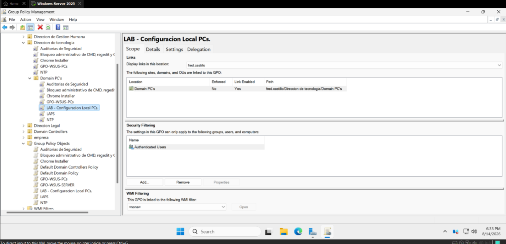
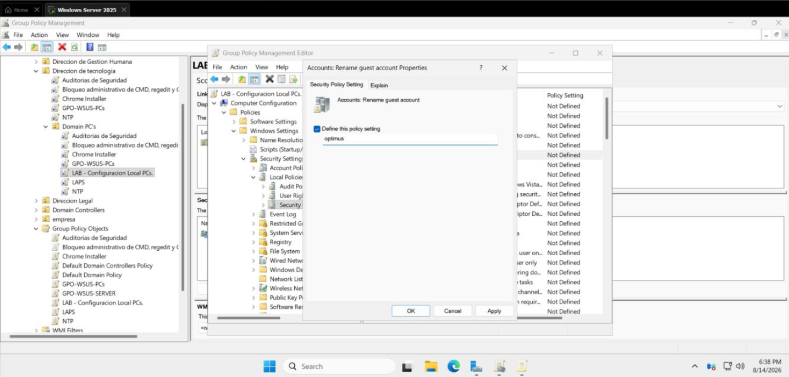
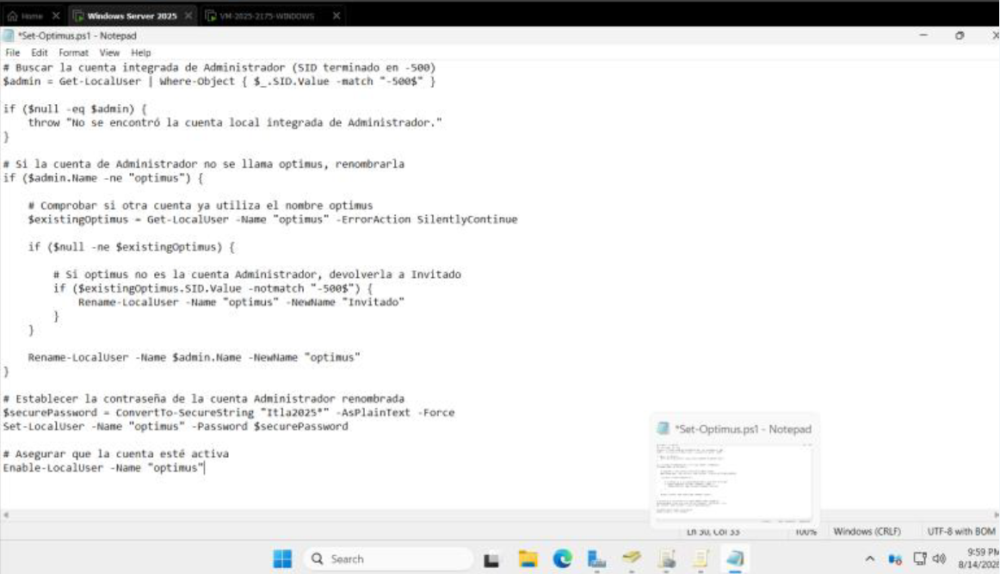
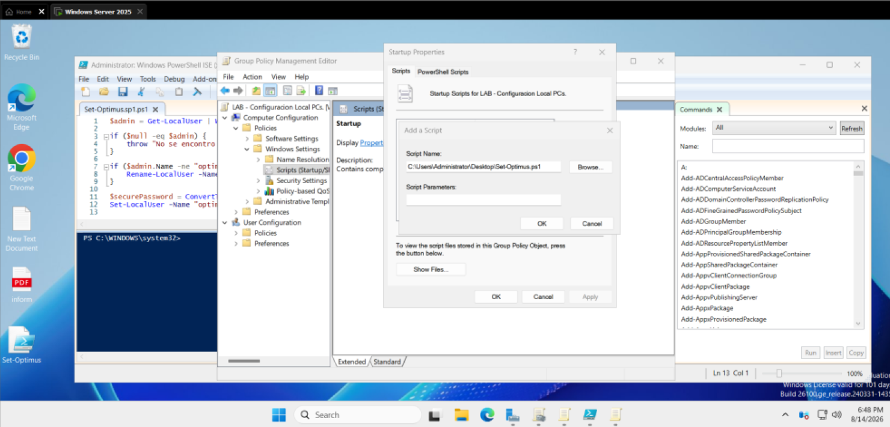
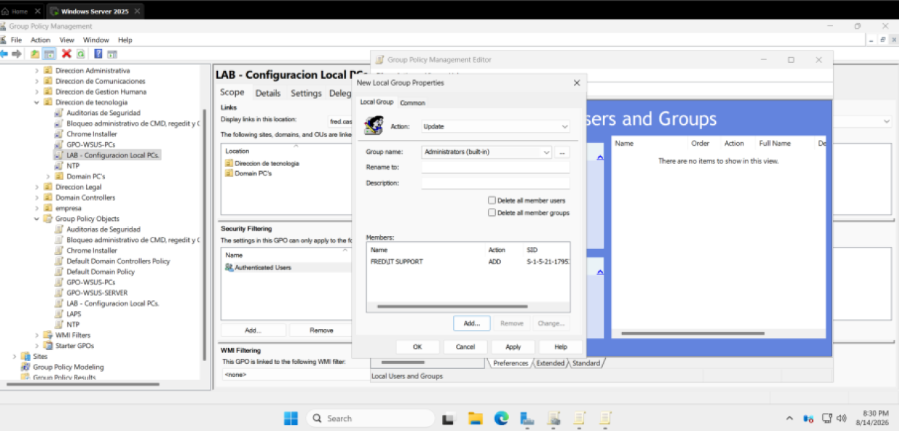
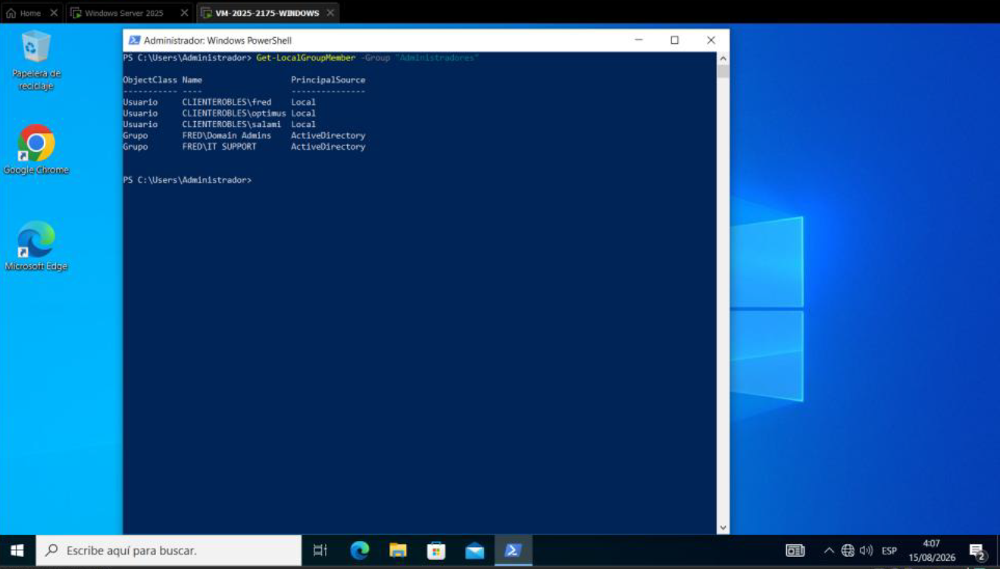

# Local Administrator Management with Group Policy

🇬🇧 **English** | 🇪🇸 [Español](README.md)

## Objective

Implement centralized management of local administrator accounts and privileges using **Group Policy** on domain-joined computers.

The laboratory addresses three main requirements:

1. Rename the built-in local administrator account from `Administrator` to `optimus`.
2. Set the account password through a PowerShell Startup Script.
3. Add a domain user group to the local `Administrators` group.

The goal is to demonstrate how Group Policy can apply a consistent local account and privilege configuration across computers within a specific OU.

---

## Lab Environment

| Component             | Configuration                    |
| --------------------- | -------------------------------- |
| Server                | Windows Server 2025              |
| Directory service     | Active Directory Domain Services |
| Management            | Group Policy                     |
| Client                | Domain-joined Windows computer   |
| Managed local account | `optimus`                        |
| Domain group          | `FRED\IT SUPPORT`                |
| Target local group    | `Administrators`                 |

---

## Solution Design

The implementation uses three Group Policy mechanisms:

| Requirement                        | Mechanism                                         |
| ---------------------------------- | ------------------------------------------------- |
| Rename Administrator               | Security Options                                  |
| Change password                    | PowerShell Startup Script                         |
| Add domain group to Administrators | Group Policy Preferences - Local Users and Groups |

The laboratory uses a Startup Script to configure the password. For production environments, storing fixed passwords in scripts or Group Policy configurations is not recommended; a dedicated solution such as Windows LAPS is more appropriate for managing local credentials.

---

## Architecture

```text
                         Active Directory
                               │
                               ▼
                        Domain Computer OU
                               │
                               ▼
                  GPO - Local PC Configuration
                               │
             ┌─────────────────┼──────────────────┐
             │                 │                  │
             ▼                 ▼                  ▼
       Rename Account     Startup Script     Local Users &
       Administrator       Set-Optimus.ps1      Groups
             │                 │                  │
             ▼                 ▼                  ▼
          optimus       Configure password    FRED\IT SUPPORT
                                                   │
                                                   ▼
                                          Local Administrators
```

---

# 1. Create the GPO

On the domain controller, open:

```text
Server Manager
└── Tools
    └── Group Policy Management
```

Locate the OU containing the client computers and create a new GPO linked to that OU.

The GPO is used to centrally manage local accounts and privileges on the target computers.



---

# 2. Rename the Administrator Account

The first configuration changes the name of the built-in local administrator account.

In the GPO editor, navigate to:

```text
Computer Configuration
└── Policies
    └── Windows Settings
        └── Security Settings
            └── Local Policies
                └── Security Options
```

Locate:

```text
Accounts: Rename administrator account
```

Enable:

```text
Define this policy setting
```

and set the new name to:

```text
optimus
```



---

# 3. Create the Startup Script

The password for `optimus` is configured through a PowerShell script executed during system startup.

The script identifies the built-in Administrator account by its SID ending in:

```text
-500
```

A sanitized version of the script is:

```powershell
# Find the built-in Administrator account
$admin = Get-LocalUser |
    Where-Object { $_.SID.Value -match "-500$" }

if ($null -eq $admin) {
    throw "The built-in Administrator account was not found."
}

# Rename the account if necessary
if ($admin.Name -ne "optimus") {
    Rename-LocalUser -Name $admin.Name -NewName "optimus"
}

# Set the password
$securePassword = ConvertTo-SecureString "<LAB_PASSWORD>" -AsPlainText -Force
Set-LocalUser -Name "optimus" -Password $securePassword

# Enable the account
Enable-LocalUser -Name "optimus"
```

The laboratory script is saved as:

```text
Set-Optimus.ps1
```

The real password must not be included in the repository.

---

# 4. Add the Script as a Startup Script

In the GPO editor, navigate to:

```text
Computer Configuration
└── Policies
    └── Windows Settings
        └── Scripts (Startup/Shutdown)
            └── Startup
                └── PowerShell Scripts
```

Add:

```text
Set-Optimus.ps1
```

as a PowerShell Startup Script.



The script runs during system startup when the Group Policy computer configuration is processed.

---

# 5. Add the Domain Group to Administrators

The next configuration adds a domain user group to the local Administrators group.

In this laboratory:

```text
FRED\IT SUPPORT
```

is used.

In the GPO editor, navigate to:

```text
Computer Configuration
└── Preferences
    └── Control Panel Settings
        └── Local Users and Groups
```

Create:

```text
New
└── Local Group
```

Configure:

```text
Action: Update
Group Name: Administrators
Member to add: FRED\IT SUPPORT
```

Use **Update** instead of **Replace** so existing members of the local group are not unnecessarily overwritten.



---

# 6. Apply the GPO on the Client

Verify that the client computer is located in the OU where the GPO is linked.

On the client, open PowerShell or CMD as Administrator and run:

```powershell
gpupdate /force
```

Then restart the computer:

```cmd
shutdown /r /t 0
```

The restart allows the computer configuration and Startup Script to process during system boot.

---

# 7. Verify the Administrator Rename

After restarting the client, open PowerShell and run:

```powershell
Get-LocalUser
```

The output should contain:

```text
optimus
```

You can also use:

```text
lusrmgr.msc
```

and navigate to:

```text
Local Users and Groups
└── Users
```



This confirms that the built-in Administrator account has been renamed to `optimus`.

---

# 8. Verify Local Login

Sign out of the administrative session and test the local account:

```text
.\optimus
```

Use the password configured by the Startup Script.

Do not display the actual password in screenshots or public documentation.

---

# 9. Verify Local Administrators Membership

On the client, run:

```powershell
Get-LocalGroupMember -Group "Administrators"
```

Depending on the system language, the group may appear as:

```text
Administrators
```

or:

```text
Administradores
```

The output should contain:

```text
FRED\IT SUPPORT
```

as a member of the local Administrators group.



---

# 10. Verify Administrative Privileges

Sign in with a user belonging to the domain group and run:

```powershell
whoami
```

Then:

```cmd
net localgroup administrators
```

These commands help verify the authenticated identity and the domain group's membership in the local Administrators group.

---

# Troubleshooting

### The account is still named Administrator

Verify that the client is in the correct OU and run:

```powershell
gpresult /r
```

Confirm that the GPO is applied and that no other Group Policy overrides the setting.

### optimus exists but the password did not change

Verify that:

```text
Set-Optimus.ps1
```

is configured as a PowerShell Startup Script.

Restart the client and check:

```text
Event Viewer
└── Applications and Services Logs
    └── Microsoft
        └── Windows
            └── GroupPolicy
                └── Operational
```

### The domain group does not appear in Administrators

Verify the group format:

```text
DOMAIN\Group
```

For this laboratory:

```text
FRED\IT SUPPORT
```

Also verify:

```text
Action = Update
```

in the Local Users and Groups configuration.

### Administrators appears under a different name

Run:

```powershell
Get-LocalGroup
```

to determine the actual localized name of the local group.

---

# Security Considerations

This laboratory demonstrates:

* centralized Group Policy management;
* local account renaming;
* startup script execution;
* local group management;
* centralized assignment of administrative privileges.

However, **a fixed password stored in a Startup Script is not an appropriate production design**.

For this reason:

* the real password is not included in this repository;
* `<LAB_PASSWORD>` is used as a placeholder;
* screenshots must not expose credentials;
* the original document should be sanitized before publication.

For production environments, a dedicated solution such as Windows LAPS is more appropriate for managing local administrator passwords.

---

# Result

The GPO provides centralized configuration for computers within the target OU:

```text
Administrator
      ↓
   optimus

Startup Script
      ↓
Password configuration

FRED\IT SUPPORT
      ↓
Local Administrators
```

The laboratory demonstrates how Group Policy can centrally manage local administrator accounts and assign local administrative privileges to selected domain groups.

---

## Documentation

This module was documented using a technical **How-To with laboratory screenshots**, since no demonstration video was produced.

---

## 👨‍💻 Author

**Fred Castillo**  
*Information Security Technologist Student*  
*Aspiring Red Team | Offensive Security*

[](https://www.linkedin.com/in/fredcastillo11/)
[](https://github.com/fredcastillo)

---
